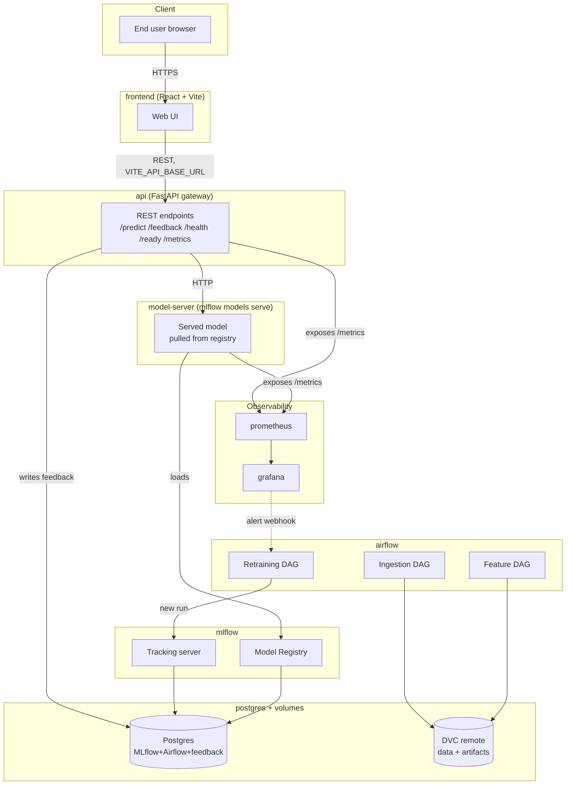

# Architecture

## System diagram

## Block explanations

### `frontend` (React + Vite + Tailwind)
The only thing the end user touches. Entirely decoupled from model logic — it speaks REST to the API gateway using a configurable `VITE_API_BASE_URL` and can be pointed at a different backend without a rebuild. Ships its own container.

### `api` (FastAPI)
The UI-facing REST gateway. Owns request validation, authentication (future), structured logging, request-ID propagation, and Prometheus instrumentation. Does **not** load the model itself — it forwards inference requests to the model server. This separation satisfies the "MLflow API-ification" rubric item.

### `model-server` (`mlflow models serve`)
Loads the model currently flagged in the MLflow Model Registry (Production → Staging fallback) and exposes it over HTTP. Swapping models is a registry stage transition, not a redeploy. Enables the rollback mechanism required by the MLOps guidelines.

### `mlflow`
Backs two functions:
- **Tracking server** — every training run logs params, metrics, artifacts, plus custom fields (git SHA, DVC data hash, sample predictions, confusion matrix).
- **Model Registry** — versioned models with Staging / Production / Archived stages. Postgres backend makes stage transitions durable.

### `airflow`
Orchestrates scheduled work:
- Ingestion DAG (hourly / daily)
- Feature engineering DAG
- Retraining DAG triggered by drift alerts or a cron schedule

### `postgres`
Single shared RDBMS hosting three logical databases: `mlflow` (experiment + registry metadata), `airflow` (DAG state), and `feedback` (ground-truth labels submitted via `/feedback`). Using one DB container keeps the local stack small.

### `prometheus` + `grafana`
Prometheus scrapes `/metrics` from every service on a 5-second interval. Grafana provides near-real-time dashboards and alerting. Alerts fire to Airflow's retraining DAG via webhook when `error_rate > 5%` or feature drift is detected.

### DVC remote
Local remote (a directory outside the repo) storing large data artifacts and model binaries. Git tracks `.dvc` pointer files; the actual bytes live in the remote.

## Data flow

1. **Training path**: Airflow ingest → validate → feature-engineer → DVC-tracked parquet → MLflow training run → Model Registry → model-server reload.
2. **Inference path**: browser → frontend → `/predict` on api → forwards to model-server → response bubbles back → metrics emitted at every hop.
3. **Feedback path**: user submits ground-truth via frontend → `/feedback` on api → postgres → nightly aggregation in Airflow → drift + decay metrics in Grafana → retrain trigger when thresholds breach.

## Why this topology

| Decision | Rationale |
|---|---|
| Three distinct service layers (frontend / api / model-server) | Required by MLOps doc: "one for the API, one for the model server, and one for monitoring" |
| Loose coupling via configurable REST | Required by Evaluation rubric: independent blocks, configurable REST only |
| Postgres-backed MLflow | File-based tracking is unreliable for registry stage transitions |
| DVC on top of Git + Git LFS | Rubric requires all three for code/data/model versioning |
| Airflow over cron or custom scripts | Rubric requires Airflow, Spark, Ray, or custom; Airflow gives us the UI for free |
| React frontend (not Streamlit) | Streamlit violates loose coupling (imports Python). UI/UX is 6 points — we need polish headroom. |
