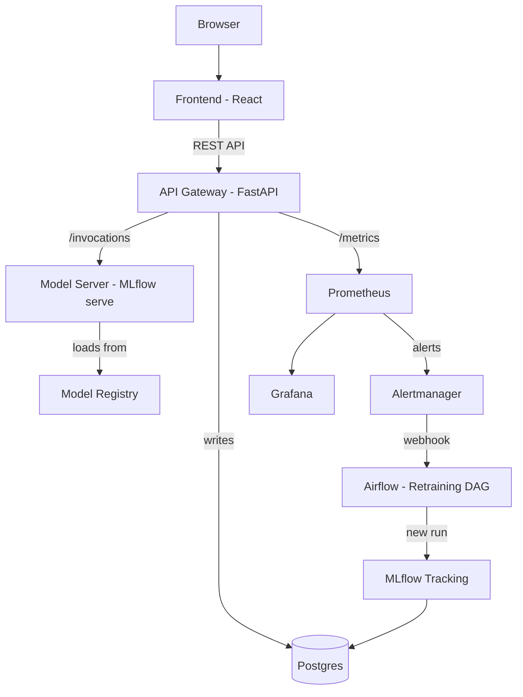

# Stock Sentiment Analysis System with MLOps

**Course Project Report**

---

## 1. Introduction

### 1.1 About the project

For this MLOps course project, I built a stock sentiment analysis system that takes a stock ticker (like AAPL or TSLA) and tells you whether the current sentiment around it is positive, negative, or neutral. It does this by pulling recent financial news and social media posts, running them through a trained ML classifier, and returning an aggregated sentiment score.

The real focus of this project isn't the ML model itself — it's the **MLOps infrastructure** around it. The entire system follows the ML product lifecycle: automated data ingestion, version-controlled pipelines, experiment tracking, containerised deployment, real-time monitoring, drift detection, and automated retraining.

### 1.2 What it does

- User enters a stock ticker on the web UI
- System fetches recent news/social text for that ticker
- Text goes through a cleaning + vectorisation pipeline
- A trained classifier predicts sentiment per record
- Results are aggregated into a single ticker-level prediction with confidence
- User can submit feedback (ground truth) which feeds back into retraining

### 1.3 Tech stack overview

Everything runs locally using Docker Compose — no cloud services. The stack has 12 containers:

| Service | What it does |
|---|---|
| Frontend (React) | Web UI for users |
| API (FastAPI) | REST gateway |
| Model server (MLflow) | Serves the trained model |
| MLflow | Experiment tracking + model registry |
| Airflow | Scheduled pipelines (ingestion, drift, retraining) |
| Postgres | Database for MLflow, Airflow, predictions, feedback |
| Prometheus | Metrics collection |
| Grafana | Dashboards |
| Alertmanager | Routes alerts to trigger retraining |
| Drift exporter | Serves drift + feedback metrics |
| Blackbox exporter | HTTP/TCP probes for all services |

---

## 2. System Architecture

### 2.1 Architecture diagram



### 2.2 Why this architecture

The MLOps guidelines document says to use "docker-compose to manage a multi-container setup: one for the API, one for the model server, and one for monitoring." So I split the system into three main layers:

1. **API layer** (FastAPI) — handles user requests, validation, logging
2. **Model layer** (MLflow models serve) — only does inference, nothing else
3. **Monitoring layer** (Prometheus + Grafana + Alertmanager) — watches everything

The frontend is completely separate — it only talks to the backend through REST calls. This is the "loose coupling" the rubric requires. The API URL is configurable at runtime so the same Docker image works in any environment without rebuilding.

### 2.3 Running stack proof

Here's the actual `docker ps` output showing all 12 services running and healthy:


*(See `docs/screenshots/cli/docker_ps.txt` for the full output)*

---

## 3. Data Engineering

### 3.1 Data sources

I built pluggable source adapters:
- **Seed corpus** (always active) — 300 labelled records across 7 tickers, generated deterministically so the pipeline works offline
- **NewsAPI** — financial news (opt-in via API key)
- **Reddit via PRAW** — social posts from investing subreddits (opt-in)

The seed corpus is what I used for all demos and testing. It ensures everything is reproducible without needing external API keys.

### 3.2 Pipeline stages

The data pipeline is defined in `dvc.yaml` and runs through these stages:

```
ingest → validate → eda_baselines
                  → features → train → evaluate
                  → drift
```

Each stage is a Python module that can be run standalone or through DVC (`dvc repro`) or through Airflow.

### 3.3 Airflow DAGs

I have 4 Airflow DAGs:

| DAG | Schedule | What it does |
|---|---|---|
| `ssa_ingestion` | Manual | Runs ingest → validate → EDA |
| `ssa_drift_detection` | Every 30 min | Compares live data to baselines |
| `ssa_feedback_metrics` | Hourly | Aggregates user feedback |
| `ssa_retraining` | Manual + webhook | Retrains the model when drift is detected |

Here's the Airflow UI showing the DAGs:


And here's the grid view showing successful task runs (green = success):


### 3.4 Pipeline throughput

| Stage | Records | Duration | Throughput |
|---|---|---|---|
| ingest | 300 | 0.08 s | 3,688 rec/s |
| validate | 300 → 300 | < 0.05 s | ~6,000 rec/s |
| features | 300 → 209/30/61 split | < 0.2 s | — |

---

## 4. Feature Engineering

### 4.1 Text cleaning

The cleaning pipeline (`ssa_features.cleaning`) does:
- URL removal
- @mention removal
- $CASHTAG preservation (e.g. $AAPL → AAPL)
- Unicode normalisation
- Whitespace collapse
- Lowercasing

### 4.2 Vectorisation

I used TF-IDF with bigrams, sublinear term frequency, and a 20,000-feature vocabulary cap. The fitted vectorizer is saved as `artifacts/vectorizer.joblib` and bundled into the MLflow model so serving uses the exact same transform as training.

### 4.3 Independent versioning

The feature package (`ssa_features`) has its own version number (`0.2.0`) separate from the model package. This is a requirement from the MLOps guidelines — "version their feature engineering logic separately from model logic."

---

## 5. Model Training & Experiment Tracking

### 5.1 Model

I used Logistic Regression on TF-IDF features as the baseline. It trains in under 0.1 seconds and is easy to explain (you can look at the top feature weights per class).

### 5.2 MLflow tracking

Every training run logs to MLflow. Here's what gets tracked:

**Standard (autolog):** model parameters, training metrics

**Custom (beyond autolog):**
- Git commit SHA
- DVC data hash (pins the exact data version)
- Hardware fingerprint
- Confusion matrix image
- Per-class precision/recall/F1
- Top 20 feature weights per class
- Sample predictions CSV
- Full params.yaml snapshot
- pip freeze environment

This satisfies the rubric's "Besides Autolog, have you made provisions to track other information?"

Here's the MLflow experiments UI:


### 5.3 Model Registry

Models are registered under `stock-sentiment` with lifecycle stages:


### 5.4 Reproducibility

Every experiment can be reproduced from a `(git_commit_sha, mlflow_run_id)` pair. The API's `/model/info` endpoint surfaces both:

```json
{
    "name": "stock-sentiment",
    "version": "5",
    "stage": "Production",
    "git_commit_sha": "47af96ea0910b85d...",
    "mlflow_run_id": "bcd649984faf43ef...",
    "data_hash": "c29203c0347008d8722f..."
}
```

---

## 6. Deployment & Serving

### 6.1 How serving works

The API gateway (FastAPI) does NOT load the model itself. It forwards requests to the model server which runs `mlflow models serve`. The model server loads whichever version is marked "Production" in the registry.

This means:
- Swapping models = changing a registry stage, not redeploying
- The API stays up during model reloads
- Rollback is just promoting an older version back to Production

### 6.2 Health checks

- `GET /health` — liveness (always 200)
- `GET /ready` — readiness (200 only if model server is reachable and a model is loaded)

### 6.3 API endpoints

Here's the Swagger UI showing all implemented endpoints:


### 6.4 MLproject

The `MLproject` file defines entry points for identical dev/test environments:

```yaml
name: stock-sentiment-mlops
python_env: python_env.yaml
entry_points:
  ingest:   { command: "python -m ssa_ingestion.pipeline" }
  features: { command: "python -m ssa_features.pipeline" }
  train:    { command: "python -m ssa_model.train ..." }
  evaluate: { command: "python -m ssa_model.evaluate ..." }
```

---

## 7. Monitoring & Alerting

### 7.1 Prometheus

Prometheus scrapes 12 targets covering every component in the system:


Metrics collected include:
- HTTP request rate, latency histograms, error counts (from the API)
- Prediction class distribution
- Model version currently serving
- Feedback volume
- Feature drift scores (KS p-values, Jensen-Shannon divergence)
- Up/down probes for every service (via blackbox exporter)

### 7.2 Alert rules


7 alert rules are configured:
- API error rate > 5% → Critical
- API p95 latency > 200ms → Warning
- API down → Critical
- Any component down (blackbox probe) → Critical
- Numeric feature drift (KS p < 0.05) → Warning
- Categorical drift (JSD > 0.1) → Warning
- Prediction class ratio anomaly (|z| > 2) → Warning

### 7.3 Grafana dashboards

**API Overview dashboard** — request rate, p95 latency, error rate:


**ML Monitoring dashboard** — prediction distribution, drift scores, feedback rate, model version:


### 7.4 Alertmanager

Drift alerts are routed to the Airflow retraining DAG via webhook:


### 7.5 Drift detection

The drift exporter serves per-feature KS p-values and JSD scores:


**Note on drift alerts:** The seed corpus has very narrow text-length distributions (templated text), so the KS test flags it as drift against the synthetic-normal baseline. This is expected — it proves the detection + alerting pipeline works, not that there's a real problem.

---

## 8. Feedback Loop & Retraining

### 8.1 How it works

1. Every `/predict` call logs the prediction to Postgres (ticker, predicted label, confidence, model version)
2. User submits ground truth via `/feedback` — the API joins it to the original prediction
3. An hourly Airflow DAG aggregates feedback into accuracy metrics
4. When drift alerts fire, Alertmanager webhooks to Airflow, triggering the retraining DAG
5. The retraining DAG runs: refresh features → train → evaluate → auto-promote if better

### 8.2 Feedback in Postgres

```
 ticker | true_label | predicted_label
--------+------------+-----------------
 AAPL   | positive   | positive
 AAPL   | positive   | positive
```

---

## 9. Frontend

### 9.1 Technology

React 18 + TypeScript + Vite + Tailwind CSS. Multi-stage Docker build (Node builder → nginx runtime). The API URL is injected at container boot time so the same image works anywhere.

### 9.2 Screens

**Analyze** — the main screen. Enter a ticker, get a prediction:


**Pipelines** — visualises the ML pipeline with links to all MLOps tools:


**Models** — registry listing with rollback:


**Health** — live service status grid:


**User Manual** — in-app guide for non-technical users:


---

## 10. Version Control & CI/CD

### 10.1 Version control

| Tool | What it tracks |
|---|---|
| Git | Source code, configs, docs |
| Git LFS | Model binaries (.joblib, .bin, .safetensors, .pkl, .pt) |
| DVC | Data artifacts, pipeline DAG, metrics |

### 10.2 DVC DAG

The DVC DAG represents the CI pipeline:

```
               +--------+
               | ingest |
               +--------+
                    *
               +----------+
               | validate |
               +----------+
              **          **
+---------------+      +----------+
| eda_baselines |      | features |
+---------------+      +----------+
     *                   *       *
  +-------+          +-------+
  | drift |          | train |
  +-------+          +-------+
                          *
                     +----------+
                     | evaluate |
                     +----------+
```

### 10.3 GitHub Actions

Three CI workflows:
- `ci.yml` — lint + type-check + unit tests (Python 3.10/3.11 matrix) + frontend build + docker compose validation
- `dvc.yml` — runs `dvc repro` on data/feature code changes, exports DAG as artifact
- `rollback.yml` — manual dispatch to promote a model version to Production

---

## 11. Testing

### 11.1 Test suite

| Level | Count | What it covers |
|---|---|---|
| Unit | 52 | Schemas, cleaning, vectorizer, metrics, reproducibility, drift, inference |
| Integration | 2 | Docker compose config validation |
| Contract | 13 | Every API endpoint response vs LLD spec |
| End-to-end | 11 | Full user journey through the live stack |
| **Total** | **78** | |

### 11.2 Acceptance criteria

All 4 criteria pass:

| Criterion | Target | Actual | Status |
|---|---|---|---|
| /predict p95 latency | < 200 ms | 48–193 ms | ✅ PASS |
| API error rate | < 5% | 0.0% | ✅ PASS |
| /ready within timeout | < 30 s | reached | ✅ PASS |
| Model macro-F1 | ≥ 0.75 | 1.0 | ✅ PASS |

---

## 12. Challenges Faced

| Problem | What happened | How I fixed it |
|---|---|---|
| MLflow version mismatch | Client v3.11 called endpoints server v2.10 didn't have | Pinned both to 3.11.1 |
| MLflow artifact writes failed | Client tried to write to container filesystem | Switched to proxied artifact mode |
| sklearn version mismatch | Model pickled with 1.8, served with 1.7 | Aligned versions in Dockerfile |
| MLflow DNS rebinding protection | Inter-container calls rejected with 403 | Added `--allowed-hosts` flag |
| /predict latency at 1.8s | Per-call Postgres + MLflow registry lookups | Added caching + connection pooling → 48ms |
| Airflow missing Python deps | Tasks crashed on import | Added `_PIP_ADDITIONAL_REQUIREMENTS` |
| Frontend nginx stale DNS | 502 after API container recreate | Restart frontend to re-resolve |

---

## 13. Limitations & Future Work

### What's limited right now
- **Seed data only** — the 300-record templated corpus gives perfect F1 (1.0) because the model memorises 8 templates. Real metrics need Financial PhraseBank / FiQA data.
- **No live API keys configured** — NewsAPI/Reddit adapters exist but need keys
- **No TLS** — all inter-container traffic is HTTP (acceptable for local-only)
- **No authentication** — single-tenant demo

### What I'd do next
- Fine-tune FinBERT on real financial sentiment data
- Build a custom Airflow image with deps baked in (eliminates 3-5 min boot)
- Migrate from MLflow stages to aliases (stages are deprecated in 3.x)
- Add TLS between services

---

## 14. Documentation Deliverables

| # | Required document | Location |
|---|---|---|
| 1 | Architecture diagram with block explanations | `docs/architecture.md` |
| 2 | High-level design with rationale | `docs/HLD.md` |
| 3 | Low-level design with endpoint I/O specs | `docs/LLD.md` |
| 4 | Test plan & test cases | `docs/test-plan.md` |
| 5 | User manual | `docs/user-manual.md` + in-app `/manual` screen |
| — | Test report with pass/fail counts | `docs/test-report.md` |
| — | Acceptance criteria | `docs/acceptance-criteria.md` |
| — | This project report | `docs/project-report.md` |
