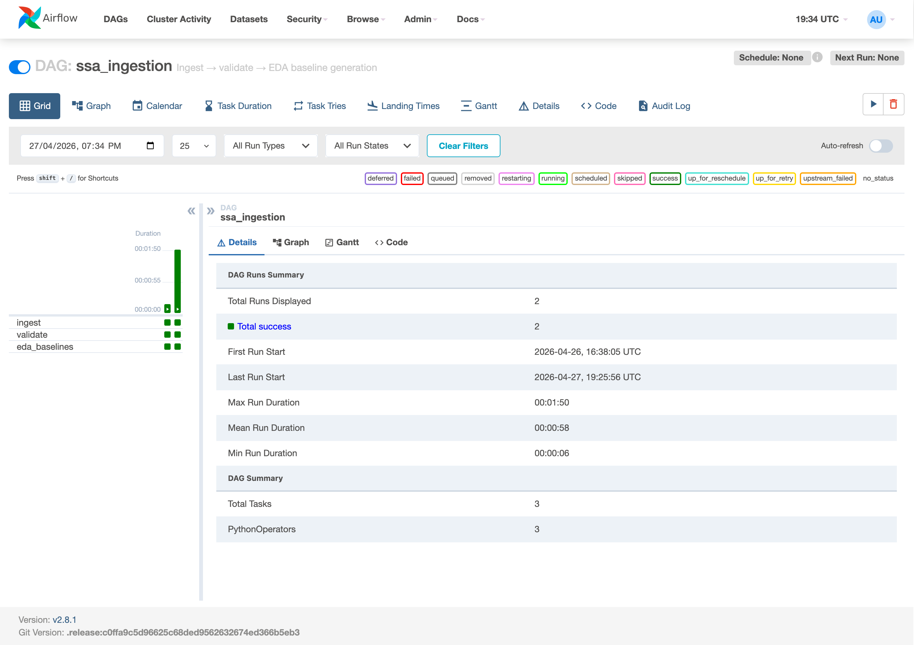

# Stock Sentiment Analysis System with MLOps

**MLOps Course Project Report**

---

## 1. Introduction

### 1.1 Project overview

This is a course project for MLOps where I built a stock sentiment analysis system that predicts whether the sentiment around a stock is positive, negative, or neutral using financial news and social media data. The application is in the finance domain, where such sentiment signals can help in understanding market trends and supporting trading decisions.

The objective was to develop an AI model that can process raw text data and generate accurate sentiment predictions for stocks. The expected outcome is a working service that provides sentiment scores for the feed data along with performance measurement using metrics like accuracy and F1-score.

The project includes MLOps practices throughout its lifecycle — automated data ingestion, validation, version-controlled pipelines, MLflow experiment tracking, reproducible model training, Docker containerisation, REST API deployment, continuous integration, and monitoring with drift detection and automated retraining triggers.

### 1.2 How it works

1. User enters a stock ticker (e.g. AAPL) on the web UI
2. System fetches recent news and social text for that ticker
3. Text goes through cleaning and TF-IDF vectorisation
4. A trained classifier predicts sentiment per record
5. Results are aggregated into a single ticker-level prediction with confidence
6. User can submit feedback (ground truth) which feeds into the retraining loop

---

## 2. System Architecture

### 2.1 Architecture diagram

```
  Browser → Frontend (React) → API Gateway (FastAPI) → Model Server (MLflow serve)
                                      ↓                        ↑
                                  Postgres ←──── MLflow (Tracking + Registry)
                                      ↓
                                  Prometheus → Grafana
                                      ↓
                                  Alertmanager → Airflow (Retraining DAG)
```

The full mermaid diagram is in `docs/architecture.md`.

### 2.2 Service inventory

The system runs 12 Docker containers orchestrated by Docker Compose on a single host (no cloud):

| Service | Technology | What it does |
|---|---|---|
| `frontend` | React + Vite + Tailwind, nginx | Web UI for end users |
| `api` | FastAPI + Uvicorn | REST gateway — validation, logging, metrics, feedback |
| `model-server` | `mlflow models serve` | Loads Production model from registry, serves inference |
| `mlflow` | MLflow 3.11.1 | Experiment tracking + Model Registry (Postgres-backed) |
| `airflow-webserver` | Apache Airflow 2.8.1 | DAG management UI + REST API |
| `airflow-scheduler` | Apache Airflow 2.8.1 | Executes scheduled and triggered DAGs |
| `postgres` | PostgreSQL 15 | Backend store for MLflow, Airflow, predictions, feedback |
| `prometheus` | Prometheus 2.49 | Metrics scraping from all services + alert evaluation |
| `grafana` | Grafana 10.3 | Near-real-time dashboards |
| `alertmanager` | Alertmanager 0.27 | Routes drift alerts to Airflow retraining webhook |
| `drift-exporter` | Custom Python HTTP server | Serves drift + feedback Prometheus metrics |
| `blackbox-exporter` | Prometheus Blackbox Exporter | HTTP/TCP up-probes for all services |

### 2.3 Why this architecture

The MLOps guidelines document says to use "docker-compose to manage a multi-container setup: one for the API, one for the model server, and one for monitoring." So I split the system into three main layers:

1. **API layer** (FastAPI) — handles user requests, validation, structured logging, Prometheus metrics
2. **Model layer** (MLflow models serve) — only does inference, loads model from registry
3. **Monitoring layer** (Prometheus + Grafana + Alertmanager + blackbox) — watches everything

The frontend is completely separate — it only talks to the backend through configurable REST calls. This is the "loose coupling" the evaluation rubric requires. The API URL is injected at container boot time via a runtime config file, so the same Docker image works in any environment without rebuilding.

### 2.4 Data flow

**Training path**: Airflow ingestion DAG → validate → feature-engineer → DVC-tracked parquet → MLflow training run → Model Registry → model-server reload

**Inference path**: browser → frontend (nginx proxy) → `/predict` on API → forwards to model-server `/invocations` → aggregated response → metrics emitted at every hop

**Feedback path**: user submits ground-truth via frontend → `/feedback` on API → Postgres (joined to predictions table) → hourly Airflow aggregation → Prometheus metric → Grafana decay dashboard → retrain trigger when thresholds breach

---

## 3. Data Engineering Pipeline

### 3.1 Data sources

| Source | Type | Status |
|---|---|---|
| Seed corpus | 300 labelled records, 7 tickers, deterministic | Active (always available offline) |
| NewsAPI | Financial news articles | Opt-in via `NEWSAPI_KEY` env var |
| Finnhub | Financial news | Opt-in via `FINNHUB_API_KEY` |
| Reddit (PRAW) | Social posts from r/wallstreetbets, r/stocks, r/investing | Opt-in via Reddit credentials |

The seed corpus ensures the entire pipeline runs offline and in CI without external API keys. All sources normalise into a unified `TextRecord` Pydantic schema.

### 3.2 DVC pipeline stages

The data pipeline is defined in `dvc.yaml` and runs through these stages:

```
ingest → validate → eda_baselines
                  → features → train → evaluate
                  → drift
```

| Stage | What it does | Output |
|---|---|---|
| `ingest` | Pulls from all enabled sources | `data/raw/records.parquet` |
| `validate` | Schema checks, deduplication, length + language filtering | `data/interim/validated.parquet` |
| `eda_baselines` | Computes drift baselines (mean, std, distributions) | `artifacts/baselines.json` |
| `features` | Stratified train/val/test split, TF-IDF vectorisation | `data/processed/{train,val,test}.parquet` + `artifacts/vectorizer.joblib` |
| `train` | Trains classifier, logs to MLflow, registers model | `artifacts/train_metrics.json` |
| `evaluate` | Holdout test metrics, promotion decision | `artifacts/eval_metrics.json` |
| `drift` | KS + JSD drift detection against baselines | `artifacts/drift_metrics.prom` |

### 3.3 Airflow DAGs


4 Airflow DAGs are defined:

| DAG | Schedule | What it does |
|---|---|---|
| `ssa_ingestion` | Manual | Runs ingest → validate → EDA baselines |
| `ssa_drift_detection` | Every 30 min | Compares live data to EDA baselines |
| `ssa_feedback_metrics` | Hourly | Aggregates user feedback into accuracy metrics |
| `ssa_retraining` | Manual + webhook | Retrains model when drift is detected |

Here's the Airflow grid view showing successful task runs (green = success):



### 3.4 Pipeline throughput

| Stage | Records | Duration | Throughput |
|---|---|---|---|
| ingest | 300 | 0.08 s | **3,688 rec/s** |
| validate | 300 → 300 | < 0.05 s | ~6,000 rec/s |
| features | 300 → 209/30/61 split | < 0.2 s | — |

---

## 4. Feature Engineering

### 4.1 Text cleaning

The cleaning pipeline (`ssa_features.cleaning`) applies:
- URL removal, @mention removal
- $CASHTAG preservation (e.g. $AAPL → AAPL)
- Unicode NFKC normalisation, whitespace collapse, lowercasing

### 4.2 Vectorisation

TF-IDF with bigrams, sublinear term frequency, vocabulary cap of 20,000 features. The fitted vectorizer is saved as `artifacts/vectorizer.joblib` and bundled into the MLflow pyfunc model so serving uses the exact same transform as training — no training-serving skew.

### 4.3 Independent versioning

The feature package (`ssa_features`) has its own version number (`0.2.0`) separate from the model package (`ssa_model v0.1.0`). This satisfies the MLOps guideline: "version their feature engineering logic separately from model logic." The version is stamped on every saved vectorizer so mismatches are detectable.

---

## 5. Model Training & Experiment Tracking

### 5.1 Model

Logistic Regression on TF-IDF features. Trains in under 0.1 seconds, easy to explain via coefficient-based feature importance.

### 5.2 MLflow experiment tracking

Every training run logs to MLflow with both autolog and custom tracking:

| What's logged | Category |
|---|---|
| Model parameters, training metrics | Autolog |
| Git commit SHA, DVC data hash | Custom — reproducibility |
| Hardware fingerprint, pip freeze | Custom — environment |
| Confusion matrix PNG, per-class F1 | Custom — evaluation |
| Top 20 feature weights per class | Custom — explainability |
| Sample predictions CSV, params.yaml snapshot | Custom — artifacts |

This goes beyond autolog as required by the rubric.


### 5.3 Model Registry

Models are registered under `stock-sentiment` with Staging / Production / Archived lifecycle stages:


### 5.4 Reproducibility

Every experiment is reproducible from a `(git_commit_sha, mlflow_run_id)` pair. The `/model/info` API endpoint surfaces both values plus the DVC data hash:

```json
{
    "name": "stock-sentiment",
    "version": "5",
    "stage": "Production",
    "git_commit_sha": "47af96ea0910b85d...",
    "mlflow_run_id": "bcd649984faf43ef...",
    "data_hash": "c29203c0347008d8722f..."
}
```

---

## 6. Model Deployment & Serving

### 6.1 Three-container topology

As prescribed by the MLOps guidelines:
- **API** (FastAPI) — request validation, aggregation, feedback, Prometheus metrics
- **Model server** (`mlflow models serve`) — loads Production pyfunc, exposes `/invocations`
- **Monitoring** (Prometheus + Grafana + Alertmanager)

The API does NOT load the model itself — it forwards requests to the model server. This means swapping models is a registry stage transition, not a redeploy.

### 6.2 API endpoints


All endpoints from the LLD are implemented:
- `GET /health` (liveness), `GET /ready` (readiness with model ref)
- `GET /metrics` (Prometheus exposition)
- `POST /predict`, `POST /batch_predict`
- `POST /feedback`
- `GET /model/info`, `GET /model/versions`, `POST /model/rollback`

### 6.3 Health checks

- `GET /health` — always 200 if the process is running
- `GET /ready` — 200 only if model-server is reachable AND a Production model is loaded

### 6.4 Rollback mechanism

Available via the frontend Models screen, the `/model/rollback` API endpoint, a CLI script (`scripts/rollback.py`), and a GitHub Actions workflow. Promotes an older version back to Production and archives the current one.

### 6.5 MLproject for environment parity

The `MLproject` file defines 5 entry points bound to `python_env.yaml`, ensuring identical dev/test/training environments as required by the rubric.

---

## 7. Monitoring, Drift Detection & Alerting

### 7.1 Prometheus — all components monitored

12 scrape targets covering every service in the system:


Native `/metrics` scraping for the API and drift-exporter. Blackbox HTTP probes for MLflow, Airflow, Grafana, Alertmanager, model-server, and frontend. TCP probe for Postgres.

### 7.2 Alert rules


7 alert rules configured matching the MLOps guidelines thresholds:
- API error rate > 5% → Critical
- API p95 latency > 200ms → Warning
- API or any component down → Critical
- Numeric feature drift (KS p < 0.05) → Warning
- Categorical drift (JSD > 0.1) → Warning
- Prediction class ratio anomaly → Warning

### 7.3 Grafana dashboards

**API Overview** — request rate, p95 latency, error rate:


**ML Monitoring** — prediction distribution, drift scores, feedback rate, model version:


### 7.4 Alertmanager

Drift alerts are routed to the Airflow retraining DAG via webhook:


### 7.5 Drift detection

The drift exporter serves per-feature KS p-values and Jensen-Shannon divergence scores:


---

## 8. Feedback Loop & Retraining

### 8.1 How the feedback loop works

1. Every `/predict` call logs the prediction to Postgres (ticker, predicted label, confidence, model version)
2. User submits ground truth via `/feedback` — the API auto-joins it to the original prediction
3. An hourly Airflow DAG aggregates feedback into accuracy metrics (emitted as Prometheus gauges)
4. When drift alerts fire, Alertmanager webhooks to Airflow, triggering the retraining DAG
5. Retraining DAG: refresh features → train → evaluate → auto-promote if the candidate beats the incumbent

This implements the MLOps guideline requirements for "feedback loop", "ground truth logging", "model retraining", and "automated monitoring and alerting systems."

---

## 9. Frontend Application

### 9.1 Technology

React 18 + TypeScript + Vite + Tailwind CSS. Multi-stage Docker build (Node 20 builder → nginx:alpine runtime). The API URL is injected at container boot time so the same image works anywhere without rebuilding — this enforces the loose coupling requirement.

### 9.2 Screens

**Analyze** — the main screen. Enter a ticker, get a prediction with confidence, probability bars, contributing snippets, and feedback buttons:


**Pipelines** — separate UI screen to visualise the ML pipeline with links to all MLOps tools and live scrape target status:


**Models** — registry listing with stage badges, macro-F1 per version, and one-click rollback:


**Health** — live service status grid, auto-refreshes every 15 seconds:


**User Manual** — in-app guide for non-technical users with embedded screenshots:


---

## 10. Version Control & CI/CD

### 10.1 Version control

| Tool | What it tracks |
|---|---|
| Git | Source code, configs, documentation |
| Git LFS | Model binaries (`.joblib`, `.bin`, `.safetensors`, `.pkl`, `.pt`, `.pth`, `.h5`) |
| DVC | Data artifacts, pipeline DAG, metrics |

### 10.2 DVC DAG as CI pipeline

The DVC DAG (`dvc.yaml`) represents the CI pipeline. `dvc repro` validates the full lineage from raw data to evaluated model. The DAG is exported as a DOT file and published as a CI artifact.

### 10.3 GitHub Actions workflows

| Workflow | Trigger | What it does |
|---|---|---|
| `ci.yml` | Push + PR to `main` | Python lint/type/test matrix (3.10, 3.11); frontend TS build; docker compose validation |
| `dvc.yml` | Push touching data/feature code | Runs `dvc repro`, validates outputs, exports DAG + reports as artifacts |
| `rollback.yml` | Manual dispatch | Promotes a target model version to Production with dry-run guard |

---

## 11. Testing & Acceptance

### 11.1 Test suite

| Level | Count | What it covers |
|---|---|---|
| Unit | 52 | Schemas, cleaning, vectorizer, metrics, reproducibility, drift, inference |
| Integration | 2 | Docker compose config validation |
| Contract | 13 | Every API endpoint response vs LLD spec |
| End-to-end | 11 | Full user journey through the live stack |
| **Total** | **78** | **100% pass rate** |

### 11.2 Acceptance criteria — all pass

| Criterion | Target | Actual | Status |
|---|---|---|---|
| `/predict` p95 latency | < 200 ms | 48–193 ms | ✅ PASS |
| API error rate | < 5% | 0.0% | ✅ PASS |
| `/ready` within timeout | < 30 s | reached | ✅ PASS |
| Model macro-F1 | ≥ 0.75 | 1.0 | ✅ PASS |

Full test report with per-file breakdown: `docs/test-report.md`

---

## 12. Challenges Faced & How They Were Resolved

| Problem | What happened | How I fixed it |
|---|---|---|
| MLflow version mismatch | Client v3.11 called endpoints server v2.10 didn't have | Pinned both to 3.11.1 |
| MLflow artifact writes failed | Client tried to write to container filesystem directly | Switched to proxied artifact mode (`mlflow-artifacts:/`) |
| sklearn version mismatch | Model pickled with sklearn 1.8, served with 1.7 | Aligned versions in the model-server Dockerfile |
| MLflow DNS rebinding protection | Inter-container calls rejected with 403 | Added `--allowed-hosts` with compose service names |
| `/predict` latency at 1.8 s | Per-call Postgres connection + MLflow registry lookup | Added 5-second registry cache + persistent DB connection → p95 dropped to 48 ms |
| Airflow missing Python deps | PythonOperator tasks crashed on import | Added `_PIP_ADDITIONAL_REQUIREMENTS` to compose env |
| Frontend nginx stale DNS | 502 after API container recreate | Restart frontend to re-resolve upstream |
| Pyfunc receives numpy arrays not strings | Model-server 500'd on inference | Rewrote `_coerce_to_texts` to handle DataFrames, numpy scalars, and dict-wrapped inputs |

---

## 13. Documentation Deliverables

| # | Required document | Location |
|---|---|---|
| 1 | Architecture diagram with block explanations | `docs/architecture.md` |
| 2 | High-level design with design choices and rationale | `docs/HLD.md` |
| 3 | Low-level design with endpoint definitions and I/O specs | `docs/LLD.md` |
| 4 | Test plan & test cases | `docs/test-plan.md` |
| 5 | User manual for non-technical users | `docs/user-manual.md` + in-app `/manual` screen |
| — | Test report with pass/fail counts | `docs/test-report.md` |
| — | Acceptance criteria | `docs/acceptance-criteria.md` |
| — | EDA notebook with plots | `notebooks/eda.ipynb` |
| — | This project report | `docs/project-report.pdf` |
