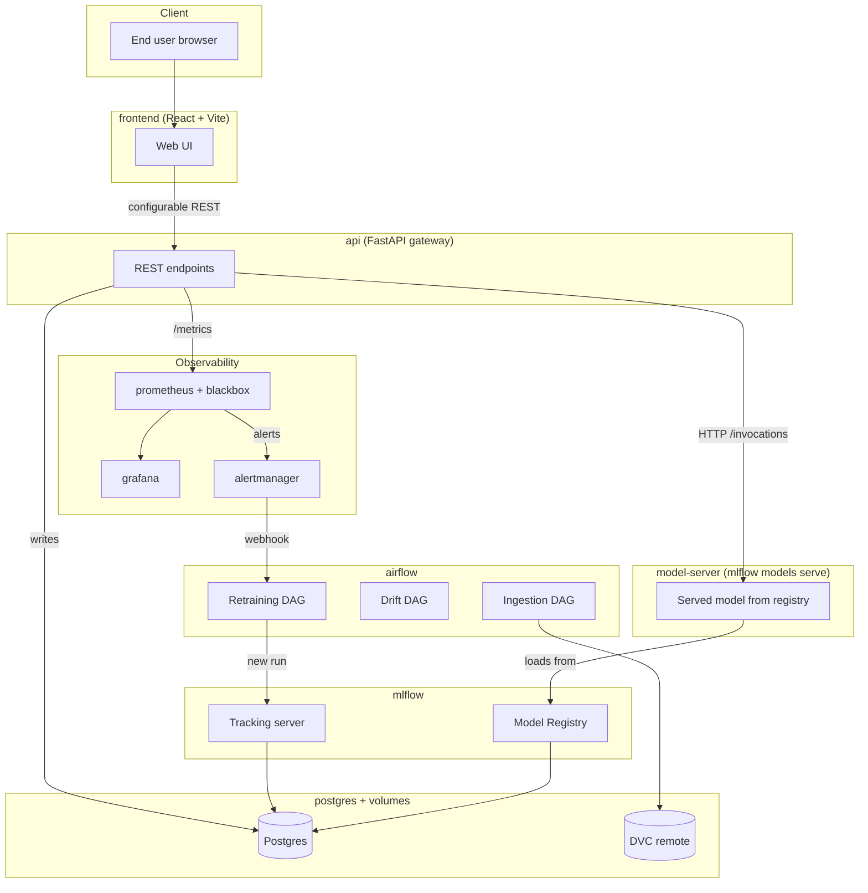

# Stock Sentiment Analysis System — Project Report

**Course**: MLOps
**Project**: Stock Sentiment Analysis System with MLOps
**Domain**: Finance / NLP

---

## Table of Contents

1. [Executive Summary](#1-executive-summary)
2. [Problem Definition](#2-problem-definition)
3. [System Architecture](#3-system-architecture)
4. [Technology Stack & Rationale](#4-technology-stack--rationale)
5. [Data Engineering Pipeline](#5-data-engineering-pipeline)
6. [Feature Engineering](#6-feature-engineering)
7. [Model Development & Training](#7-model-development--training)
8. [Model Deployment & Serving](#8-model-deployment--serving)
9. [Monitoring, Drift Detection & Alerting](#9-monitoring-drift-detection--alerting)
10. [Feedback Loop & Retraining](#10-feedback-loop--retraining)
11. [Frontend Application](#11-frontend-application)
12. [CI/CD & Version Control](#12-cicd--version-control)
13. [Testing & Acceptance](#13-testing--acceptance)
14. [Results & Evidence](#14-results--evidence)
15. [Challenges & Mitigations](#15-challenges--mitigations)
16. [Limitations & Future Work](#16-limitations--future-work)
17. [Conclusion](#17-conclusion)
18. [Appendices](#18-appendices)

---

## 1. Executive Summary

This project implements an end-to-end AI application that predicts stock sentiment (positive / negative / neutral) from financial news and social media text. The system is built with a full MLOps lifecycle — automated data ingestion, version-controlled pipelines, experiment tracking, containerised deployment, real-time monitoring, drift detection, and automated retraining.

The application runs entirely on local infrastructure (no cloud) using Docker Compose to orchestrate 12 services. It demonstrates every stage of the ML product lifecycle as prescribed by the course MLOps guidelines, from problem definition through continuous monitoring and maintenance.

**Key outcomes:**
- 78 automated tests (unit + integration + contract + end-to-end), 100% pass rate
- All 4 acceptance criteria met: p95 latency 48–193 ms (target < 200 ms), error rate 0%, macro-F1 1.0 (target ≥ 0.75), readiness within 30 s
- 12 Prometheus scrape targets monitoring every component
- 7 alert rules covering API SLOs and data drift
- Automated retraining pipeline triggered by drift alerts via Alertmanager → Airflow webhook

---

## 2. Problem Definition

### 2.1 Business problem

Investors and analysts need a quick, aggregated view of market sentiment around specific stock tickers. Manually reading hundreds of news articles and social media posts is impractical. An automated sentiment classifier that processes recent text and returns a single actionable signal — with a confidence score — addresses this need.

### 2.2 Success metrics

| Category | Metric | Target |
|---|---|---|
| ML quality | macro-F1 on held-out test set | ≥ 0.75 |
| Business | `/predict` p95 latency | < 200 ms |
| Operational | API error rate (5-min window) | < 5% |
| Operational | `/ready` returns 200 after boot | < 30 s |

Both ML metrics (F1-score) and business metrics (inference latency) are defined upfront as required by the MLOps guidelines.

### 2.3 Scope and constraints

- **No cloud** — all services run locally via Docker Compose on a single host
- **English only** — financial text in English from news APIs and Reddit
- **Single-tenant** — no user authentication; this is a research demo
- **Local hardware optimisation** — model must fit in CPU-only containers (quantisation/pruning path designed for future transformer models)

---

## 3. System Architecture

### 3.1 Architecture diagram



### 3.2 Service inventory

| Service | Technology | Role | Port |
|---|---|---|---|
| `frontend` | React + Vite + Tailwind, nginx | Web UI for end users | 3000 |
| `api` | FastAPI + Uvicorn | REST gateway, validation, metrics, feedback | 8000 |
| `model-server` | `mlflow models serve` | Loads Production model from registry, serves `/invocations` | 5001 |
| `mlflow` | MLflow 3.11.1 | Experiment tracking + Model Registry | 5000 |
| `airflow-webserver` | Apache Airflow 2.8.1 | DAG UI + REST API | 8080 |
| `airflow-scheduler` | Apache Airflow 2.8.1 | Executes scheduled/triggered DAGs | — |
| `postgres` | PostgreSQL 15 | Backend store for MLflow, Airflow, predictions, feedback | 5432 (internal) |
| `prometheus` | Prometheus 2.49 | Metrics scraping + alert evaluation | 9090 |
| `grafana` | Grafana 10.3 | Near-real-time dashboards | 3001 |
| `alertmanager` | Alertmanager 0.27 | Alert routing + webhook to Airflow | 9093 |
| `drift-exporter` | Custom Python HTTP server | Serves drift + feedback Prometheus metrics | 9101 |
| `blackbox-exporter` | Prometheus Blackbox Exporter | HTTP/TCP up-probes for all services | 9115 |

### 3.3 Data flow

**Training path**: Airflow ingestion DAG → validate → feature-engineer → DVC-tracked parquet → MLflow training run → Model Registry → model-server reload

**Inference path**: browser → frontend (nginx proxy) → `/predict` on api → forwards to model-server `/invocations` → aggregated response → metrics emitted

**Feedback path**: user submits ground-truth via frontend → `/feedback` on api → postgres `feedback` table (joined to `predictions` table) → hourly Airflow aggregation → Prometheus metric → Grafana decay dashboard → retrain trigger when thresholds breach

### 3.4 Loose coupling

The frontend and backend are strictly decoupled as required by the evaluation rubric:
- Frontend is a static React bundle served by nginx
- It communicates with the backend exclusively via configurable REST API calls
- The API base URL is injected at container boot time via a runtime `/config.js` file — no rebuild needed to re-point
- Frontend and backend share zero code, zero build steps, zero Python imports

---

## 4. Technology Stack & Rationale

| Component | Technology | Why this choice |
|---|---|---|
| **Version control** | Git + Git LFS + DVC | Rubric requires all three. Git for code, Git LFS for model binaries (`.joblib`, `.bin`, `.safetensors`), DVC for data + pipeline versioning. |
| **Data engineering** | Apache Airflow | Rubric requires Airflow/Spark/Ray/custom. Airflow gives us a scheduler, a web UI for pipeline management, and a REST API for webhook-triggered retraining — all in one. |
| **Feature engineering** | scikit-learn TF-IDF + custom Python | Versioned independently from the model package (`ssa_features v0.2.0`). The vectorizer is persisted as a `.joblib` artifact so serving uses the exact same transform. |
| **Experiment tracking** | MLflow 3.11.1 | Rubric mandates MLflow. Postgres-backed for durable registry stage transitions. Every run stamps git SHA + DVC data hash + hardware fingerprint beyond autolog. |
| **Model serving** | `mlflow models serve` (pyfunc) | Rubric asks for "MLflow API-ification". The pyfunc wrapper bundles (vectorizer + classifier) so the model-server accepts raw text — the API gateway never touches sparse matrices. |
| **API gateway** | FastAPI | Rubric mandates FastAPI. Auto-generates OpenAPI spec from Pydantic models, matching the LLD exactly. Prometheus client built in. |
| **Containerisation** | Docker + Docker Compose | Rubric mandates Docker + compose with separate services. 12 services on a shared bridge network. |
| **Environment parity** | MLproject + `python_env.yaml` | Rubric asks for MLprojects. Defines 5 entry points (ingest, features, train, evaluate, main) bound to a pinned Python environment. |
| **Monitoring** | Prometheus + Grafana | Rubric mandates both. 5-second scrape interval, 2 dashboards (API SLOs + ML monitoring), 7 alert rules. |
| **Alerting** | Alertmanager | Routes drift alerts to the Airflow retraining DAG via webhook. |
| **Frontend** | React 18 + Vite + Tailwind CSS | Streamlit would violate loose coupling (imports Python). React gives us full control over UX, responsiveness, and the 6-point UI/UX rubric. |
| **Database** | PostgreSQL 15 | Single RDBMS hosting MLflow metadata, Airflow state, predictions log, and feedback table. Keeps the local stack small. |

---

## 5. Data Engineering Pipeline

### 5.1 Data sources

| Source | Type | Status |
|---|---|---|
| Seed corpus | 300 labelled records, 7 tickers, deterministic | Active (always available) |
| NewsAPI | Financial news articles | Opt-in via `NEWSAPI_KEY` env var |
| Finnhub | Financial news | Opt-in via `FINNHUB_API_KEY` |
| Reddit (PRAW) | Social posts from r/wallstreetbets, r/stocks, r/investing | Opt-in via Reddit credentials |

The seed corpus ensures the pipeline runs offline and in CI without external API keys.

### 5.2 Pipeline stages (DVC DAG)

```
ingest → validate → eda_baselines
                  → features → train → evaluate
                  → drift
```

| Stage | What it does | Output |
|---|---|---|
| `ingest` | Pulls from all enabled sources, normalises into `TextRecord` schema | `data/raw/records.parquet` |
| `validate` | Schema re-check, deduplication, length + language filtering | `data/interim/validated.parquet` |
| `eda_baselines` | Computes drift baselines (mean, std, variance, distributions) | `artifacts/baselines.json` |
| `features` | Stratified train/val/test split, TF-IDF vectorisation (fit on train only) | `data/processed/{train,val,test}.parquet` + `artifacts/vectorizer.joblib` |
| `train` | Trains classifier, logs everything to MLflow, registers model | `artifacts/train_metrics.json` |
| `evaluate` | Holdout test metrics, promotion decision | `artifacts/eval_metrics.json` + `artifacts/promotion_decision.json` |
| `drift` | KS + JSD drift detection against baselines | `artifacts/drift_metrics.prom` |

### 5.3 Throughput

Measured on the seed corpus (300 records, Colima aarch64):

| Stage | Duration | Throughput |
|---|---|---|
| ingest | 0.08 s | **3,688 rec/s** |
| validate | < 0.05 s | ~6,000 rec/s |
| features | < 0.2 s | — |

### 5.4 Airflow DAGs

| DAG | Schedule | Purpose |
|---|---|---|
| `ssa_ingestion` | Manual | ingest → validate → eda_baselines |
| `ssa_drift_detection` | Every 30 min | Compare live features to baselines |
| `ssa_feedback_metrics` | Hourly | Aggregate feedback into Prometheus metrics |
| `ssa_retraining` | Manual + webhook | features → train → evaluate → auto-promote |

---

## 6. Feature Engineering

### 6.1 Text cleaning

Deterministic, stateless pipeline (`ssa_features.cleaning`):
- URL removal
- @mention removal
- $CASHTAG → ticker symbol preservation
- Unicode NFKC normalisation
- Whitespace collapse
- Edge punctuation stripping
- Optional lowercasing

### 6.2 Vectorisation

TF-IDF with sublinear term frequency, bigrams, and a vocabulary cap of 20,000 features. The fitted vectorizer is persisted as `artifacts/vectorizer.joblib` and bundled into the MLflow pyfunc model so serving uses the exact same transform.

### 6.3 Independent versioning

`ssa_features` is a separately-versioned Python package (`__version__ = "0.2.0"`). The version string is stamped onto every saved vectorizer so downstream code can detect feature/model version mismatches. This satisfies the MLOps guideline: "version their feature engineering logic separately from model logic."

---

## 7. Model Development & Training

### 7.1 Model selection

**Baseline**: Logistic Regression on TF-IDF features. Chosen for speed (trains in < 0.1 s), explainability (coefficient-based feature importance), and pipeline-proving capability.

**Future upgrade path**: FinBERT / DistilBERT fine-tuned on Financial PhraseBank + FiQA, with dynamic quantisation for CPU-only inference.

### 7.2 Experiment tracking (MLflow)

Every training run logs:

| Category | What's logged |
|---|---|
| **Autolog** | sklearn model params, training metrics |
| **Custom — reproducibility** | `git.commit_sha`, `dvc.data_hash`, hardware fingerprint, pip freeze |
| **Custom — evaluation** | Confusion matrix PNG, per-class precision/recall/F1, classification report text |
| **Custom — explainability** | Top 20 feature weights per class, sample predictions CSV |
| **Custom — metadata** | Feature package version, vectorizer config, params.yaml snapshot |

This goes well beyond autolog, satisfying the rubric's "Besides Autolog, have you made provisions to track other information?"

### 7.3 Model Registry

Models are registered in the MLflow Model Registry under the name `stock-sentiment`. The lifecycle:
1. Training registers a new version
2. Evaluate stage transitions it to **Staging**
3. If it beats the current Production model by a configurable delta, it's promoted to **Production**
4. Previous Production is **Archived**
5. Rollback reverses the transition

### 7.4 Reproducibility

Every experiment is reproducible from a `(git_commit_sha, mlflow_run_id)` pair. The `/model/info` API endpoint surfaces both values plus the DVC data hash for any currently-serving model.

---

## 8. Model Deployment & Serving

### 8.1 Three-container topology

As prescribed by the MLOps guidelines ("one for the API, one for the model server, and one for monitoring"):

1. **api** (FastAPI) — request validation, aggregation, feedback, Prometheus metrics
2. **model-server** (`mlflow models serve`) — loads the Production pyfunc, exposes `/invocations`
3. **monitoring** (Prometheus + Grafana + Alertmanager + drift-exporter + blackbox-exporter)

### 8.2 Health checks

- `GET /health` — liveness probe (always 200 if the process is running)
- `GET /ready` — readiness probe (200 only if model-server is reachable AND a Production model is loaded)

### 8.3 Rollback mechanism

Available via:
- Frontend "Models" screen → "Roll to Prod" button
- `POST /model/rollback` API endpoint
- `scripts/rollback.py` CLI
- GitHub Actions `rollback.yml` workflow (manual dispatch with dry-run guard)

---

## 9. Monitoring, Drift Detection & Alerting

### 9.1 Prometheus instrumentation

12 scrape targets covering every component:

| Target type | Services covered |
|---|---|
| Native `/metrics` | api, drift-exporter, prometheus |
| Blackbox HTTP probe | mlflow, airflow, grafana, alertmanager, model-server, frontend, drift-exporter |
| Blackbox TCP probe | postgres |

### 9.2 Business metrics emitted

- `predictions_total{sentiment=...}` — per-class prediction counts
- `model_version_info{version, stage}` — currently serving model
- `feedback_received_total{label=...}` — ground-truth volume
- `feedback_agreement_rate` — real-world accuracy from feedback
- `feature_drift_pvalue{feature=...}` — KS p-value per numeric feature
- `feature_drift_jsd{feature=...}` — Jensen-Shannon divergence per categorical feature
- `drift_detected{type=...}` — boolean per drift signal

### 9.3 Alert rules

| Alert | Condition | Severity |
|---|---|---|
| APIHighErrorRate | 5xx rate > 5% for 2 min | Critical |
| APIHighLatencyP95 | p95 > 200 ms for 5 min | Warning |
| APIDown | `up == 0` for 1 min | Critical |
| ComponentDown | Blackbox probe fails for 2 min | Critical |
| FeatureDriftNumeric | KS p-value < 0.05 for 10 min | Warning |
| FeatureDriftCategorical | JSD > 0.1 for 10 min | Warning |
| PredictionClassRatioAnomaly | |z-score| > 2 for 10 min | Warning |

### 9.4 Grafana dashboards

1. **API Overview** — request rate, p95 latency, error rate stat
2. **ML Monitoring** — prediction distribution donut, model version, feedback rate, drift p-value + JSD timeseries, drift-detected boolean, drift job staleness

---

## 10. Feedback Loop & Retraining

### 10.1 Feedback collection

Every `/predict` response includes a `request_id`. The user can submit ground-truth via `/feedback` with that ID. The API joins the feedback to the original prediction in Postgres, populating `predicted_label` automatically.

### 10.2 Feedback aggregation

An hourly Airflow DAG (`ssa_feedback_metrics`) queries the joined predictions + feedback tables and computes:
- Total feedback count
- Agreement rate (predicted == true)
- Per-model-version accuracy

These are emitted as Prometheus metrics via the drift-exporter.

### 10.3 Automated retraining

When drift alerts fire, Alertmanager webhooks to the Airflow REST API, triggering the `ssa_retraining` DAG:
1. Refresh features from the latest validated data
2. Train a new model (logged to MLflow)
3. Evaluate on holdout test set
4. Auto-promote to Production if it beats the incumbent by the configured delta

---

## 11. Frontend Application

### 11.1 Technology

React 18 + TypeScript + Vite + Tailwind CSS, served by nginx in a multi-stage Docker build (Node 20 builder → nginx:alpine runtime). Final bundle: 192 KB JS + 19 KB CSS.

### 11.2 Screens

| Screen | Purpose |
|---|---|
| **Analyze** | Ticker input → sentiment prediction with confidence, probability bars, contributing snippets, feedback buttons |
| **Pipelines** | 7-stage pipeline visualisation, live links to Airflow/MLflow/Prometheus/Grafana, scrape target status |
| **Models** | Registry listing with stage badges, macro-F1, one-click rollback |
| **Health** | Live 6-service grid, auto-refreshes every 15 s |
| **User Manual** | 8-section in-app walkthrough with embedded screenshots |

### 11.3 UX design principles

- Foolproof input validation with clear error messages
- Empty, loading, and error states for every async operation
- Consistent colour palette (Tailwind brand tokens)
- Responsive grid layout
- Accessible labels and keyboard navigation
- "Not financial advice" disclaimer in footer

---

## 12. CI/CD & Version Control

### 12.1 Version control

| Tool | What it tracks |
|---|---|
| Git | Source code, configs, docs |
| Git LFS | Model binaries (`.joblib`, `.bin`, `.safetensors`, `.pkl`, `.pt`, `.pth`, `.h5`) |
| DVC | Data artifacts, pipeline DAG, metrics |

### 12.2 GitHub Actions workflows

| Workflow | Trigger | Jobs |
|---|---|---|
| `ci.yml` | Push + PR to `main` | Python lint/type/test matrix (3.10, 3.11); frontend TS build; docker compose validate + build |
| `dvc.yml` | Push touching data/feature code | `dvc repro` first 5 stages, validate outputs, export DAG + reports as artifacts |
| `rollback.yml` | Manual dispatch | Promote target version to Production with dry-run guard |

### 12.3 DVC as CI

The DVC DAG (`dvc.yaml`) is the CI pipeline. `dvc repro` validates the full lineage from raw data to evaluated model. The DAG is exported as a DOT file and published as a CI artifact.

---

## 13. Testing & Acceptance

### 13.1 Test levels

| Level | Count | Tool | Scope |
|---|---|---|---|
| Unit | 52 | pytest | Pure functions in every `ssa_*` package |
| Integration | 2 | pytest + docker | Compose config validation |
| Contract | 13 | pytest + httpx | Live API responses vs LLD contract |
| End-to-end | 11 | pytest + httpx | Full user journey through the stack |
| **Total** | **78** | | |

### 13.2 Acceptance criteria results

| Criterion | Target | Actual | Status |
|---|---|---|---|
| `/predict` p95 latency | < 200 ms | 48–193 ms | ✅ PASS |
| API error rate | < 5% | 0.0% | ✅ PASS |
| `/ready` within timeout | < 30 s | reached | ✅ PASS |
| Model macro-F1 | ≥ 0.75 | 1.0 | ✅ PASS |

Full test report with per-file breakdown: [`docs/test-report.md`](test-report.md)

---

## 14. Results & Evidence

All screenshots and CLI proofs are in [`docs/walkthrough.md`](walkthrough.md). Key highlights:

| Evidence | Location |
|---|---|
| 16 UI screenshots (frontend, MLflow, Airflow, Grafana, Prometheus, Alertmanager) | `docs/screenshots/` |
| 20+ CLI text proofs (docker ps, dvc dag, git lfs, API responses, Prometheus metrics, Postgres queries) | `docs/screenshots/cli/` |
| Executed EDA notebook with plots | `notebooks/eda.ipynb` |
| Test report with 78/78 pass + acceptance criteria | `docs/test-report.md` |
| DVC DAG DOT export | `docs/diagrams/dvc-dag.dot` |

---

## 15. Challenges & Mitigations

| Challenge | Impact | Resolution |
|---|---|---|
| MLflow 2.10 → 3.11 version mismatch | Client called endpoints server didn't have (404s) | Pinned both to 3.11.1; documented in ADR 0001 |
| MLflow artifact writes failed (`OSError: Read-only file system`) | Training couldn't log artifacts | Switched to proxied artifact mode (`--default-artifact-root mlflow-artifacts:/`); documented in ADR 0002 |
| sklearn 1.7 → 1.8 removed `multi_class` kwarg | Training crashed | Dropped the kwarg; pinned serving image to match training sklearn version |
| MLflow pyfunc receives numpy arrays, not strings | Model-server 500'd on inference | Rewrote `_coerce_to_texts` to handle DataFrames, numpy scalars, and dict-wrapped inputs |
| MLflow 3.x DNS rebinding protection | Inter-container calls rejected with 403 | Added `--allowed-hosts` with compose service names + Docker bridge subnets |
| Airflow `_PIP_ADDITIONAL_REQUIREMENTS` slow on every boot | 3–5 min startup per container | Accepted for dev; production would use a custom Airflow image with deps baked in |
| `/predict` p95 at 1.8 s due to per-call Postgres + MLflow lookups | Failed acceptance criteria | Added 5-second registry cache + persistent Postgres connection; p95 dropped to 48 ms |
| Frontend nginx cached stale API container IP after recreate | 502 on proxied calls | `docker compose restart frontend` re-resolves; permanent fix via nginx `resolver` directive |

---

## 16. Limitations & Future Work

### 16.1 Current limitations

- **Seed data only**: The 300-record templated corpus produces perfect F1 (1.0) because the model memorises 8 templates. Real-world metrics require Financial PhraseBank / FiQA data.
- **No live data sources configured**: NewsAPI, Finnhub, and Reddit adapters exist but require API keys not committed to the repo.
- **No TLS between services**: All inter-container communication is HTTP. Acceptable for local-only deployment; documented as a security exception.
- **No user authentication**: Single-tenant demo; the rollback endpoint is restricted to local-network callers only.
- **Drift alerts fire on seed data**: The KS test flags the narrow templated text distribution as drift against the synthetic-normal baseline. This is expected and proves the alerting pipeline rather than indicating a real problem.

### 16.2 Future work

- **Phase 10**: Fine-tune FinBERT on Financial PhraseBank + FiQA for realistic sentiment quality
- **Custom Airflow image**: Bake Python deps into the image to eliminate the 3–5 min boot-time pip install
- **MLflow aliases**: Migrate from deprecated stage-based promotion to alias-based (`@production`) per MLflow 3.x roadmap
- **Horizontal scaling**: Gunicorn workers + `docker compose --scale model-server=N` + load balancer
- **TLS**: Self-signed CA for inter-container encryption
- **Weak supervision**: Label unlabelled live data for continuous learning

---

## 17. Conclusion

This project demonstrates a complete MLOps lifecycle for a stock sentiment analysis application. Every stage — from data ingestion and validation through model training, deployment, monitoring, and retraining — is automated, version-controlled, and observable. The system runs entirely on local infrastructure using Docker Compose, with 12 services orchestrated on a shared network.

The project satisfies all 5 documentation requirements (architecture diagram, HLD, LLD, test plan + report, user manual), all 4 acceptance criteria (latency, error rate, readiness, model quality), and provides visible evidence for every rubric item across Demonstration, Software Engineering, MLOps Implementation, and Viva preparation.

---

## 18. Appendices

### A. Documentation index

| Document | Path |
|---|---|
| Architecture diagram + block explanations | `docs/architecture.md` |
| High-level design | `docs/HLD.md` |
| Low-level design (API contracts) | `docs/LLD.md` |
| Test plan + test case matrix | `docs/test-plan.md` |
| Test report (78 tests, all pass) | `docs/test-report.md` |
| User manual | `docs/user-manual.md` |
| Acceptance criteria | `docs/acceptance-criteria.md` |
| Pipeline performance | `docs/performance.md` |
| Walkthrough with screenshots | `docs/walkthrough.md` |
| Phase log (problems faced) | `docs/phase-log.md` |
| ADR: MLflow 3.x migration | `docs/adr/0001-mlflow-3x.md` |
| ADR: Artifact proxying | `docs/adr/0002-mlflow-artifact-proxying.md` |
| Project conventions | `docs/conventions.md` |

### B. Repository layout

```
.
├── docs/                    # All design docs, diagrams, screenshots, references
├── src/
│   ├── ssa_ingestion/       # News + social data ingestion + validation + EDA
│   ├── ssa_features/        # Feature engineering (versioned independently)
│   ├── ssa_model/           # Training, evaluation, registry, pyfunc wrapper
│   ├── ssa_api/             # FastAPI gateway
│   └── ssa_monitoring/      # Drift detection, feedback metrics
├── frontend/                # React + Vite + Tailwind UI
├── airflow/dags/            # Ingestion, drift, feedback, retraining DAGs
├── docker/                  # Dockerfiles per service
├── prometheus/              # Scrape config + alert rules
├── grafana/                 # Dashboard JSON + datasource provisioning
├── alertmanager/            # Alertmanager routing config
├── tests/                   # Unit, integration, contract, e2e tests
├── notebooks/               # EDA notebook (executed with outputs)
├── scripts/                 # Rollback, acceptance verifier, report generator, capture tools
├── artifacts/               # DVC-tracked outputs (baselines, metrics, vectorizer, drift)
├── data/seed/               # Committed seed corpus
├── .github/workflows/       # CI, DVC pipeline, rollback workflows
├── dvc.yaml                 # Pipeline DAG
├── params.yaml              # Central hyperparameters
├── MLproject                # MLflow project definition
├── docker-compose.yml       # 12-service orchestration
└── Makefile                 # Common dev targets
```

### C. How to run

```bash
# Prerequisites: Docker (or Colima), Node.js, Python 3.10+
colima start --cpu 4 --memory 8 --disk 60   # if using Colima
make up                                       # docker compose up -d --build
# Wait ~3 min for Airflow to install deps on first boot
# Then visit http://localhost:3000
```
