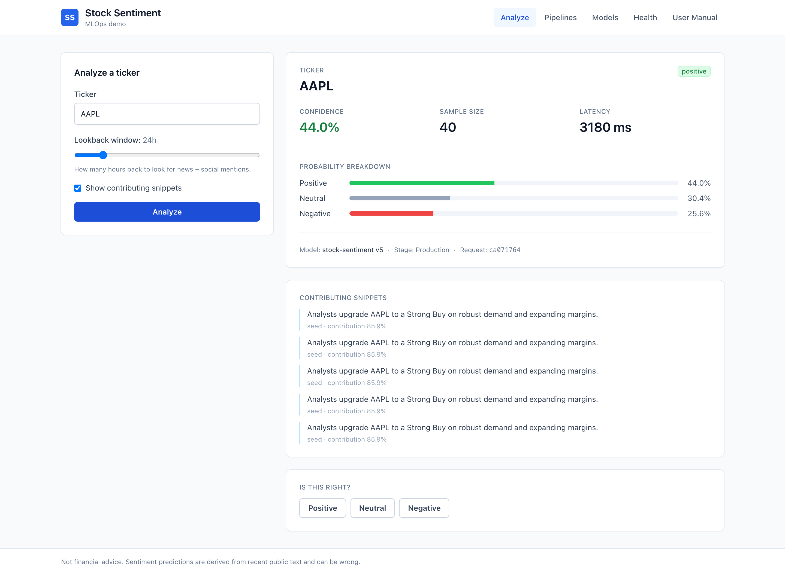
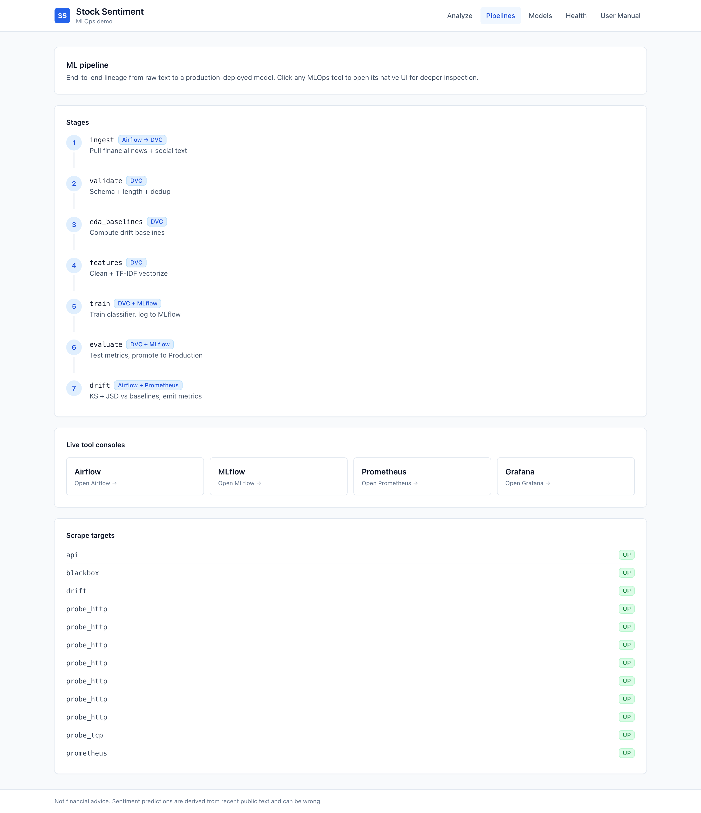
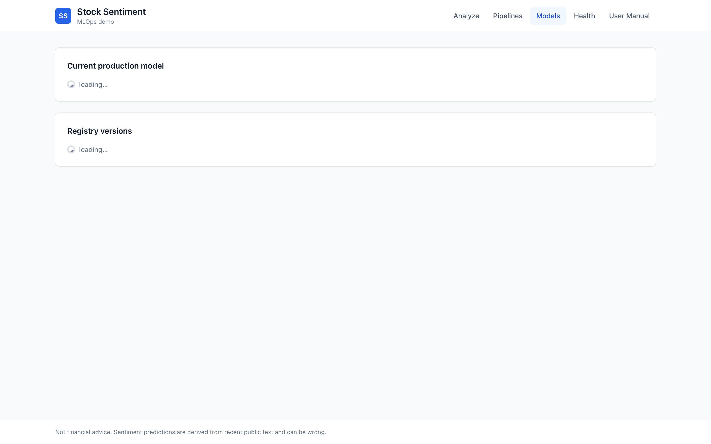
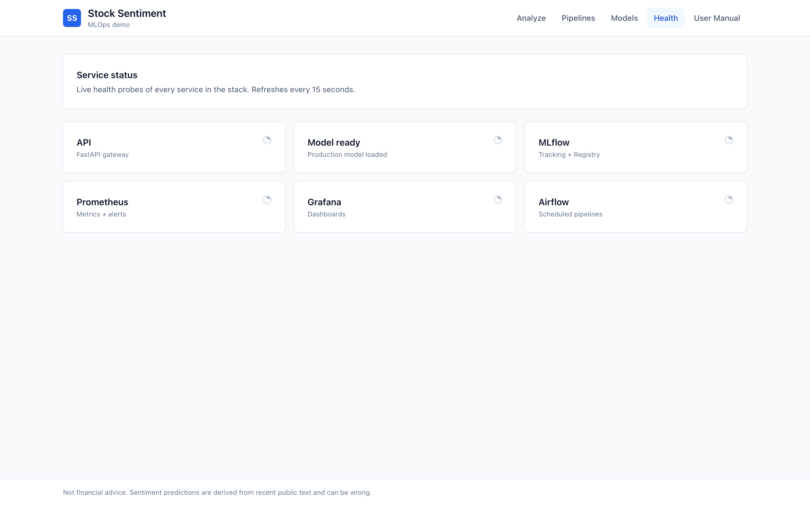

# User Manual

A short walkthrough for non-technical users. The app runs entirely on your machine — no cloud, no account, no personal data leaves your computer.

## Intended audience

Retail investors, analysts, or anyone curious about the current sentiment around a stock ticker based on recent financial news and social-media chatter. **This is not financial advice.**

---

## 1. What the app does

Given a stock ticker like `AAPL`, the app aggregates recent news articles and social posts, runs them through an ML sentiment classifier, and returns:

- A single **sentiment** label — *positive*, *neutral*, or *negative*
- A **confidence** score (0–100 %)
- A **probability breakdown** across all three labels
- The **sample size** (how many items it based the answer on)
- Optional **contributing snippets** showing which specific texts drove the result

## 2. How to open the app

With the stack running:

- **Main app**: <http://localhost:3000>
- API documentation: <http://localhost:8000/docs>
- Admin tools: MLflow (5000), Airflow (8080), Grafana (3001), Prometheus (9090)

## 3. Analyze a ticker

1. On the landing screen (**Analyze** tab), type a ticker in uppercase — `AAPL`, `MSFT`, `NVDA`, etc.
2. Drag the **lookback** slider to choose how many hours of history to scan (1–168 h).
3. Tick **Show contributing snippets** if you want to see which specific texts drove the result.
4. Click **Analyze**. A card appears on the right with the sentiment, confidence, probability breakdown, and model metadata.

## 4. Reading the result

| Field | What it means |
|---|---|
| **Sentiment badge** | Colour-coded label the model is most sure about |
| **Confidence** | How strongly the model backs that label |
| **Sample size** | Number of news + social records aggregated |
| **Latency** | How long the round-trip took in milliseconds |
| **Probability breakdown** | Bars showing the split across all three classes (they sum to 1.0) |
| **Model v#** | Which model version served the prediction — click the **Models** tab to see the registry |
| **Request id** | Unique id for this prediction — used when submitting feedback |

## 5. Submitting feedback

Under every result, three buttons let you report the true sentiment. Feedback is stored and aggregated to measure real-world accuracy decay — the model can be retrained on real mistakes over time.

## 6. Viewing the pipeline

Click **Pipelines** in the top nav to see every stage of the ML pipeline with live links to the underlying MLOps tools:

- **Airflow** — scheduled runs (ingestion, drift, retraining)
- **MLflow** — every training experiment + the model registry
- **Prometheus** — raw metrics
- **Grafana** — live dashboards

The bottom of the page shows which scrape targets Prometheus is currently monitoring successfully.

## 7. Managing models

Click **Models** to see every version in the MLflow Model Registry with its stage (Production / Staging / Archived) and test-set macro-F1 score. If a newly-deployed model misbehaves, the **Roll to Prod** button next to an older version restores it.

## 8. Service health

**Health** shows a live grid of every service. It refreshes every 15 seconds. If any tile turns red, click through to the corresponding admin tool.

## 9. Troubleshooting

| Symptom | Fix |
|---|---|
| "Model unavailable" | Model server still starting up. Wait ~60 s and retry. |
| "No recent data for ticker" | The seed dataset only covers a handful of tickers. Try `AAPL`, `MSFT`, `NVDA`, `TSLA`, `GOOGL`, `AMZN`, `META`. |
| Pages won't load | Check the Health screen. Any red tile tells you which service to inspect. |
| Prediction takes > 2 s | First call after a container restart is cold. Subsequent calls settle to < 100 ms. |

## 10. Privacy and safety

- **No personal data** is collected or stored.
- Predictions run **locally** — nothing leaves your machine.
- This is a **research demo**, not financial advice. Don't trade on it.

## 11. Glossary

| Term | Meaning |
|---|---|
| **Sentiment** | Whether text expresses positive, negative, or neutral feelings |
| **Confidence** | Probability the model assigns to its top pick (0–1) |
| **F1 score** | Quality metric for a classifier; higher is better; max 1.0 |
| **Drift** | When live data starts looking different from what the model trained on. Monitored automatically. |
| **Rollback** | Restoring a previous model version when the current one breaks |
| **Staging / Production / Archived** | Lifecycle stages in the model registry |

---

*Screenshots and functional behaviour are reproducible from a fresh `docker compose up -d` with the bundled seed data.*
