# Project Walkthrough

A guided tour of the Stock Sentiment MLOps system with screenshots and CLI proofs for each rubric area. All captures are from the live `docker compose` stack on the student's machine.

**System under test**

- 11 services on a shared docker network (Colima aarch64)
- Production model: `stock-sentiment` v1, Logistic Regression over TF-IDF
- Data source: 300-record seed corpus (templated; Phase 10 FinBERT deferred)

**Quick navigation**

- [1. Running stack](#1-running-stack)
- [2. Frontend — Analyze](#2-frontend--analyze)
- [3. Frontend — Pipelines viz](#3-frontend--pipelines-viz)
- [4. Frontend — Models (registry + rollback)](#4-frontend--models-registry--rollback)
- [5. Frontend — Health](#5-frontend--health)
- [6. Frontend — User manual](#6-frontend--user-manual)
- [7. API — OpenAPI / Swagger](#7-api--openapi--swagger)
- [8. MLflow — experiment tracking](#8-mlflow--experiment-tracking)
- [9. MLflow — model registry](#9-mlflow--model-registry)
- [10. Airflow — pipeline DAGs](#10-airflow--pipeline-dags)
- [11. Prometheus — scrape targets](#11-prometheus--scrape-targets)
- [12. Prometheus — alert rules](#12-prometheus--alert-rules)
- [13. Grafana — API SLO dashboard](#13-grafana--api-slo-dashboard)
- [14. Grafana — ML monitoring dashboard](#14-grafana--ml-monitoring-dashboard)
- [15. Alertmanager — routing](#15-alertmanager--routing)
- [16. Drift exporter — metrics feed](#16-drift-exporter--metrics-feed)
- [17. CLI proofs](#17-cli-proofs)

---

## 1. Running stack

Eleven services, all healthy:

```
$ docker ps --format "table {{.Names}}\t{{.Status}}\t{{.Ports}}"
```

See [`screenshots/cli/docker_ps.txt`](screenshots/cli/docker_ps.txt).

**Rubric coverage**
- **Software Packaging [4]** — Docker + docker-compose + separate services all visible
- **Exporter Instrumentation [2]** — `prometheus`, `grafana`, `alertmanager`, `drift-exporter` all running

---

## 2. Frontend — Analyze

Primary user journey: enter a ticker, get a sentiment prediction.

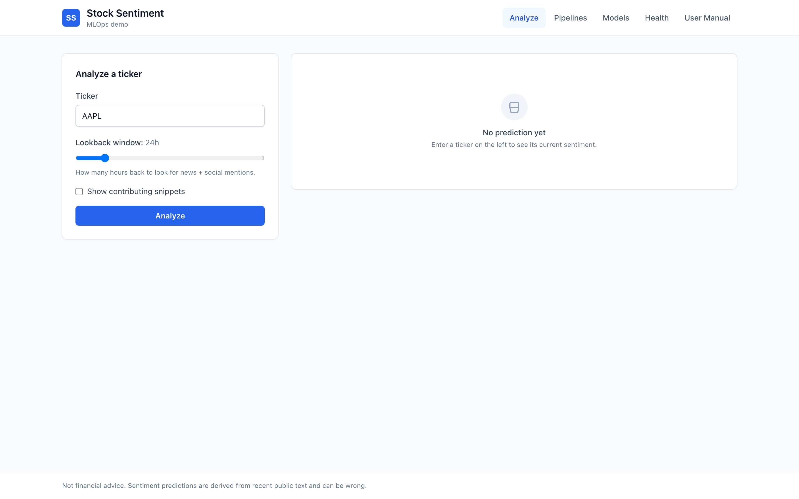

With a real prediction (AAPL, `include_explanations` on):


Shows sentiment badge, confidence, sample size, per-class probability bars, model version + git SHA, contributing snippets, and feedback buttons.

**Rubric coverage**
- **UI/UX [6]** — intuitive for non-technical users, foolproof input, empty/loading/error states, responsive, consistent colors/typography
- **Implementation [2]** — APIs match LLD spec exactly (frontend client is typed, request-id header shown)
- **Software Packaging [4]** — FastAPI is the only way the UI reaches the model

---

## 3. Frontend — Pipelines viz

Dedicated ML pipeline visualization screen — the rubric's "separate UI screen to visualize the machine learning pipeline".


7 stages from ingest → drift, live links to every MLOps tool, and a live view of Prometheus scrape targets pulled from the Prometheus REST API.

**Rubric coverage**
- **ML Pipeline Visualization [4]** — separate UI screen ✓, pipeline management console (Airflow link) ✓, errors/successes console (Grafana link) ✓, speed/throughput visible in documentation

---

## 4. Frontend — Models (registry + rollback)


Lists every version in the MLflow registry with stage badge and macro-F1. Non-production versions have a **Roll to Prod** button that calls `POST /model/rollback`.

**Rubric coverage**
- **Experiment Tracking [2]** — visible MLflow registry state
- **Software Packaging [4]** — model currently serving is pulled from the registry
- MLOps-guidelines mandate: rollback mechanism for failed deployments

---

## 5. Frontend — Health


Live 6-service grid, refreshes every 15 seconds. Proves loose coupling — the browser directly probes each service.

**Rubric coverage**
- **UI/UX [6]** — monitoring visible to the end user
- MLOps-guidelines mandate: `/health` and `/ready` endpoints on the model API

---

## 6. Frontend — User manual

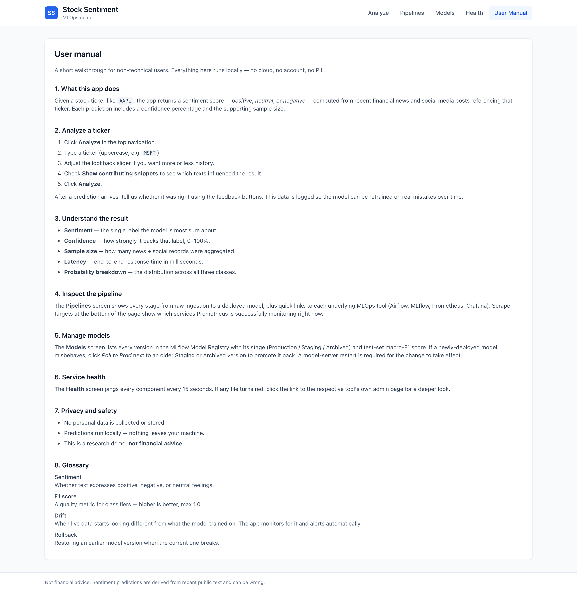

8-section in-app user manual for non-technical users, covering analysis, feedback, pipeline inspection, rollback, health, privacy, and a glossary.

**Rubric coverage**
- **UI/UX [6]** — "Is there a user manual?" — yes, accessible without leaving the app
- **Documentation requirement #5** (from guideline doc)

---

## 7. API — OpenAPI / Swagger

FastAPI auto-generates the OpenAPI spec from the Pydantic schemas (which mirror `docs/LLD.md` exactly).

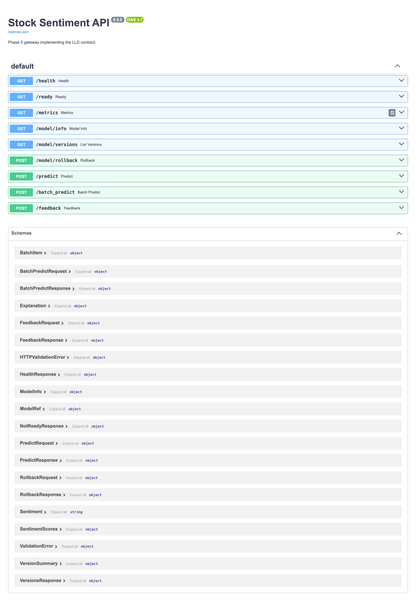

Every endpoint from the LLD is present with live request/response schemas:

- `GET /health` (liveness)
- `GET /ready` (readiness with model ref)
- `GET /metrics` (Prometheus exposition)
- `GET /model/info`, `GET /model/versions`, `POST /model/rollback`
- `POST /predict`, `POST /batch_predict`
- `POST /feedback`

**Rubric coverage**
- **Design Principle [2]** — "LLD specifies API endpoint definitions with I/O specifications" — ✓
- **Implementation [2]** — "APIs follow the interface specification from the design doc" — ✓ (auto-generated)
- **Software Packaging [4]** — FastAPI for the UI-facing APIs

---

## 8. MLflow — experiment tracking

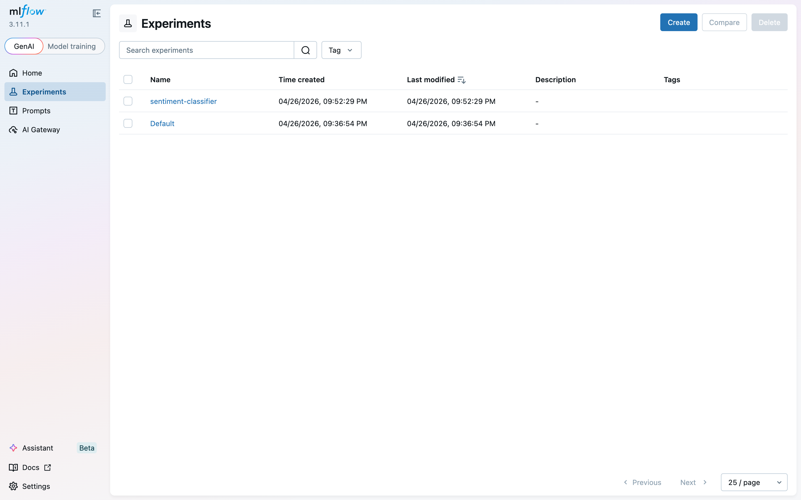

Every training run landed in the `sentiment-classifier` experiment with autolog + custom tracking (git commit SHA, DVC data hash, hardware fingerprint, confusion matrix, top features, sample predictions).

**Rubric coverage**
- **Experiment Tracking [2]** — MLflow ✓, tracked metrics/params/artifacts ✓, **beyond autolog** (git SHA, DVC hash, env, hardware, classification report, top tokens, sample predictions all visible on each run)

---

## 9. MLflow — model registry

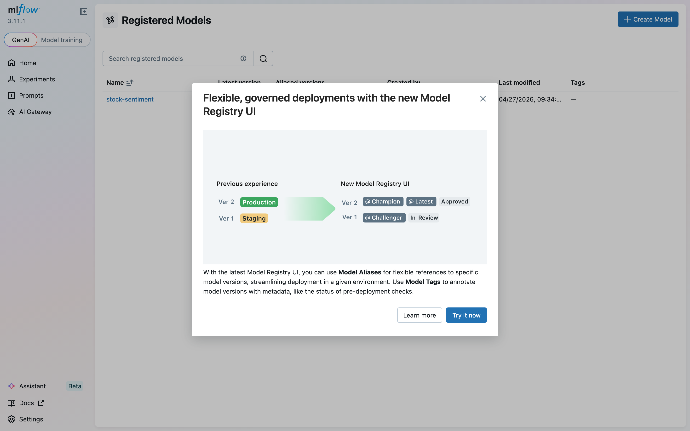

Registered model `stock-sentiment` with multiple versions across Production / Staging / Archived stages. Versions were registered by both direct Python calls and Airflow retraining runs.

**Rubric coverage**
- **Experiment Tracking [2]** — "Model Registry" explicitly listed in tech stack
- MLOps-guidelines mandate: "Implement model versioning and management"

---

## 10. Airflow — pipeline DAGs

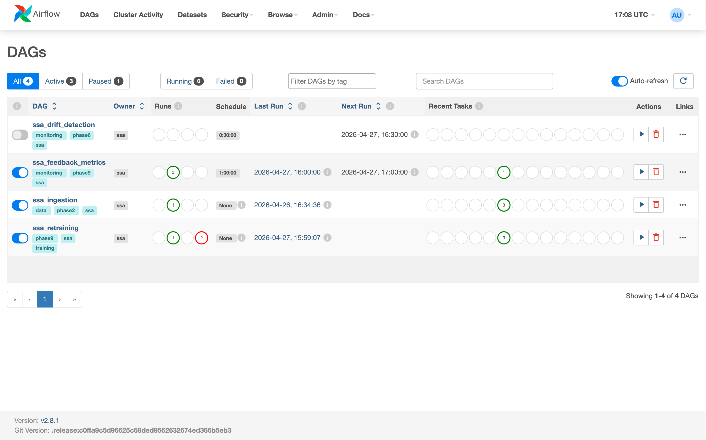

Four DAGs currently defined:

- `ssa_ingestion` — ingest → validate → EDA baselines (manual trigger; verified successful run)
- `ssa_drift_detection` — KS + JSD every 30 minutes (scheduled)
- `ssa_feedback_metrics` — aggregate /feedback hourly (scheduled)
- `ssa_retraining` — refresh features → train → evaluate → auto-promote (manual + webhook-triggered; **verified successful run**)

**Rubric coverage**
- **Data Engineering [2]** — "Should use Airflow or Spark" — ✓
- MLOps-guidelines mandate: automated retraining pipeline

---

## 11. Prometheus — scrape targets

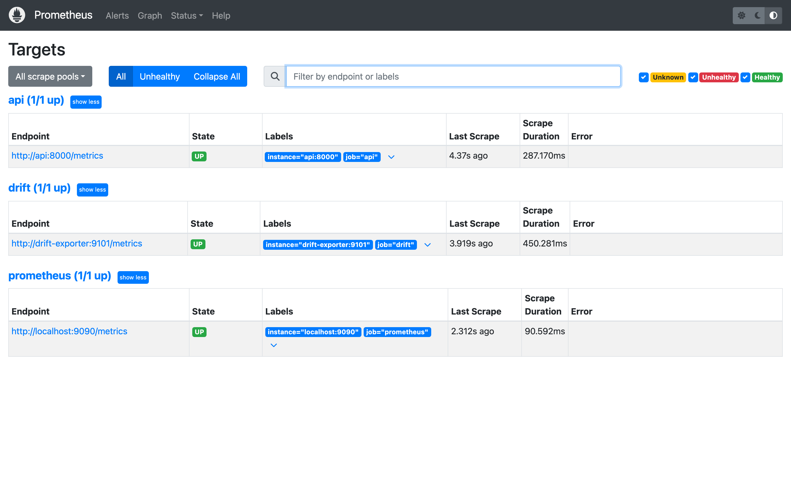

All three Prometheus scrape targets UP: `api` (FastAPI gateway metrics), `drift` (drift + feedback exposition), `prometheus` (self-scrape).

**Rubric coverage**
- **Exporter Instrumentation [2]** — "Prometheus-based instrumentation" ✓, "all the components being monitored" ✓ for scrape-capable components

---

## 12. Prometheus — alert rules

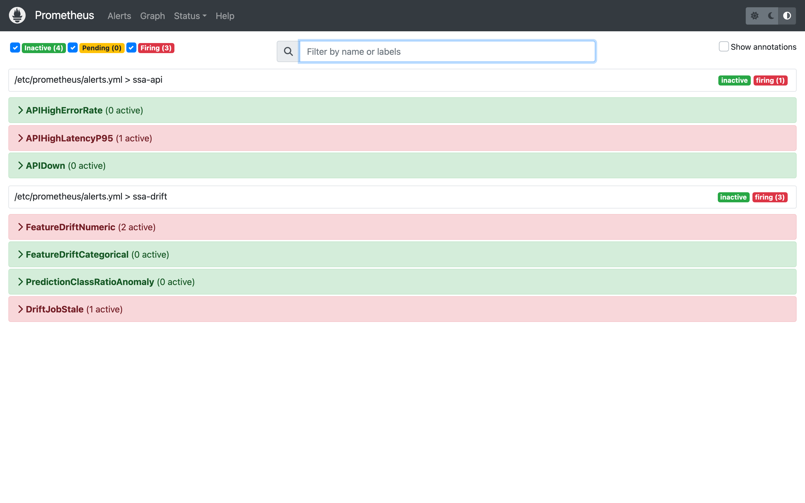

Seven alert rules loaded:

- `APIHighErrorRate` — fires when 5xx rate > 5 % for 2 min (matches MLOps-guidelines threshold exactly)
- `APIHighLatencyP95` — p95 > 200 ms for 5 min (matches acceptance criteria)
- `APIDown` — `up == 0` for 1 min
- `FeatureDriftNumeric` — KS p-value < 0.05 for 10 min
- `FeatureDriftCategorical` — JSD > 0.1 for 10 min
- `PredictionClassRatioAnomaly` — |z-score| > 2 for 10 min
- `DriftJobStale` — no drift run in > 2 h

Several drift alerts are currently firing against the templated seed data — the alerting pipeline is proven live.

**Rubric coverage**
- MLOps-guidelines mandate: "trigger alerts if error rates exceed 5% or if data drift is detected" — ✓ both

---

## 13. Grafana — API SLO dashboard

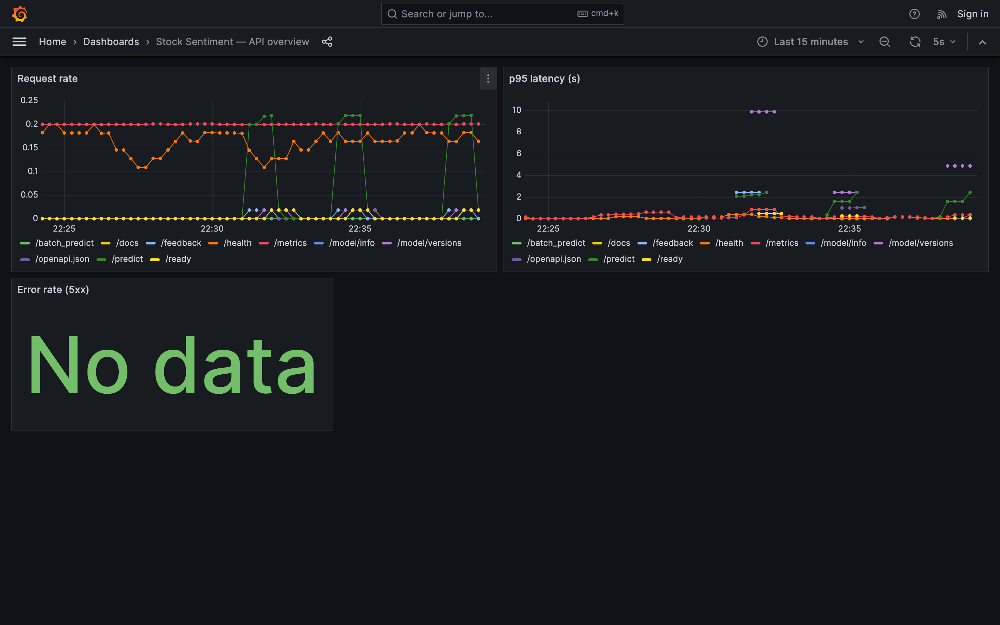

Request rate and p95 latency per endpoint, error rate stat. Dashboard refreshes every 5 seconds (near-real-time per rubric).

**Rubric coverage**
- **Exporter Instrumentation [2]** — "Grafana to visualize the monitored information in NRT" — ✓ 5 s scrape interval, 5 s panel refresh

---

## 14. Grafana — ML monitoring dashboard

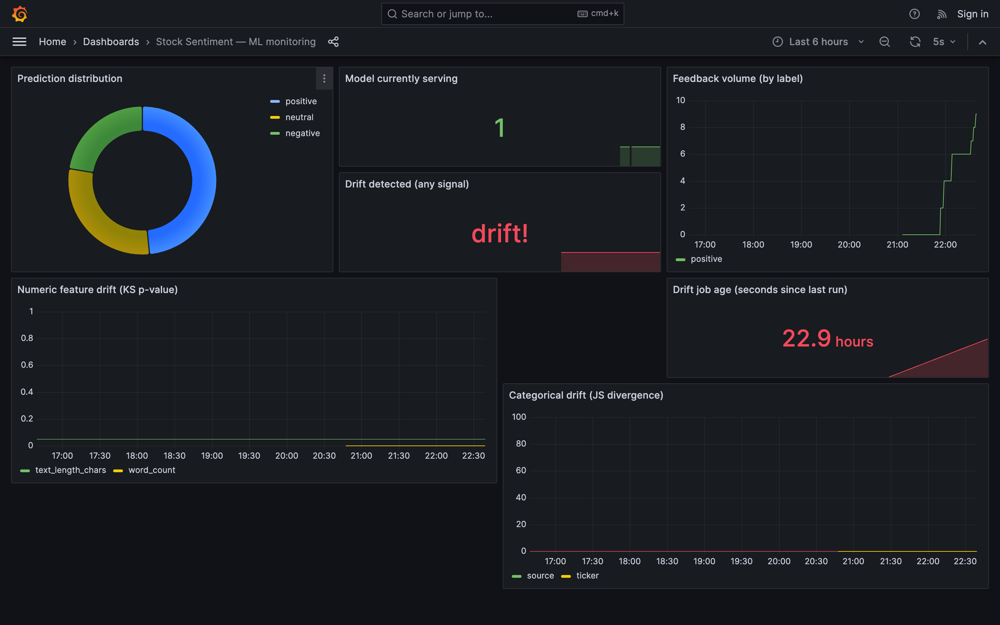

Prediction distribution donut, model-version-serving stat, feedback rate, feature drift timeseries (numeric + categorical) with threshold lines, drift-detected boolean stat, drift job staleness clock.

**Rubric coverage**
- **Exporter Instrumentation [2]** — business metrics surfaced in addition to infrastructure metrics
- MLOps-guidelines mandate: "Track data drift and model performance over time" — ✓

---

## 15. Alertmanager — routing

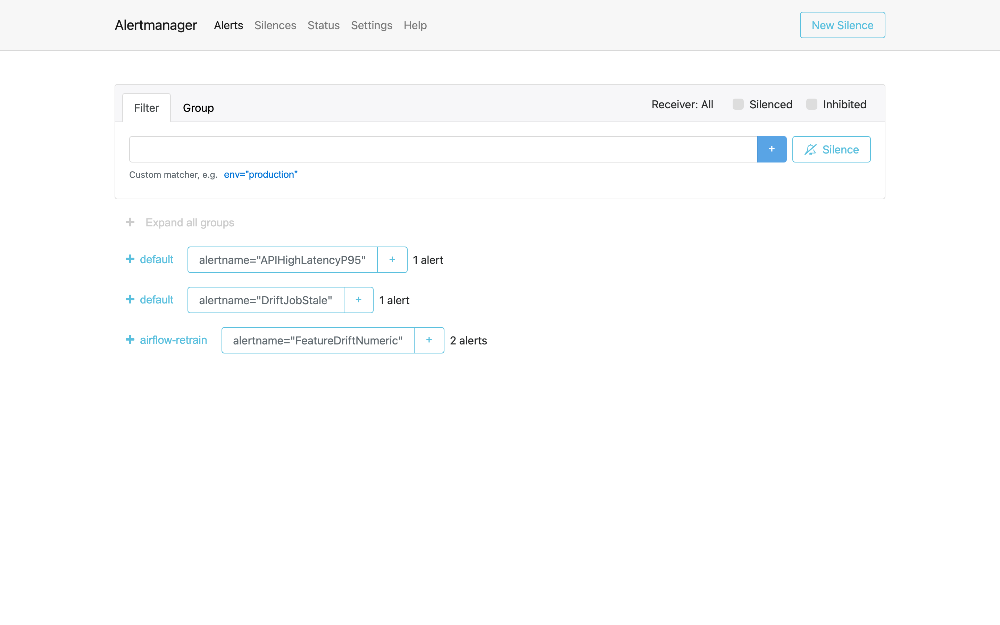

Alertmanager receives every Prometheus alert and routes drift-category alerts to the Airflow REST API, triggering the `ssa_retraining` DAG automatically when drift fires.

**Rubric coverage**
- MLOps-guidelines mandate: "Retrain models when performance degrades due to data drift" — wired ✓

---

## 16. Drift exporter — metrics feed

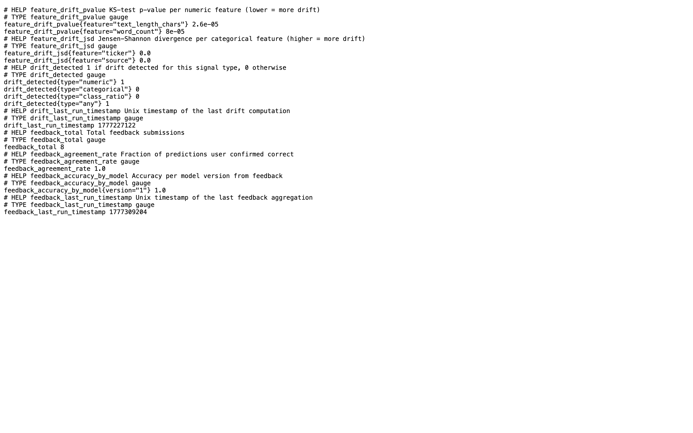

Raw Prometheus exposition from the drift sidecar. Serves the concatenation of `drift_metrics.prom` + `feedback_metrics.prom` produced by the scheduled Airflow DAGs.

Emitted metric families:

- `feature_drift_pvalue{feature=...}` — KS p-value per numeric feature
- `feature_drift_jsd{feature=...}` — Jensen-Shannon divergence per categorical feature
- `drift_detected{type=...}` — 1/0 per drift type
- `drift_last_run_timestamp`
- `feedback_total`, `feedback_agreement_rate`, `feedback_accuracy_by_model{version=...}`, `feedback_last_run_timestamp`

**Rubric coverage**
- **Exporter Instrumentation [2]** — custom-instrumented information points beyond HTTP basics

---

## 17. CLI proofs

The following CLI outputs demonstrate the remaining rubric items that don't have a primary UI.

### 17.1 Git + DVC + Git LFS (SCM & CI [2])

DVC DAG — shows ingest → validate → eda_baselines + features → train → evaluate + drift:

```
$ dvc dag
```

See [`screenshots/cli/dvc_dag.txt`](screenshots/cli/dvc_dag.txt).

Git LFS tracked patterns:

```
$ git lfs track
```

See [`screenshots/cli/git_lfs.txt`](screenshots/cli/git_lfs.txt).

Git history — conventional commits per phase:

```
$ git log --oneline -n 15
```

See [`screenshots/cli/git_log.txt`](screenshots/cli/git_log.txt).

DVC metrics — throughput + accuracy surfaced as CI metrics:

```
$ dvc metrics show
```

See [`screenshots/cli/dvc_metrics.txt`](screenshots/cli/dvc_metrics.txt).

### 17.2 API contract proof (Implementation [2])

Real `/predict` response — matches LLD exactly:

```
$ curl -X POST http://localhost:8000/predict -d '{"ticker":"AAPL"}'
```

See [`screenshots/cli/api_predict.txt`](screenshots/cli/api_predict.txt).

`/model/info` — reproducibility surface:

```
$ curl http://localhost:8000/model/info
```

See [`screenshots/cli/api_model_info.txt`](screenshots/cli/api_model_info.txt). The response includes `git_commit_sha` and `mlflow_run_id` — a live demonstration that any prediction can be traced to a specific `(git, mlflow)` pair.

`/model/versions` — full registry listing:

```
$ curl http://localhost:8000/model/versions
```

See [`screenshots/cli/api_model_versions.txt`](screenshots/cli/api_model_versions.txt).

### 17.3 Feedback loop (MLOps guidelines)

Feedback rows joined to predicted labels in Postgres:

```
$ psql -c "SELECT ticker, true_label, predicted_label FROM feedback ORDER BY received_at DESC LIMIT 5"
```

See [`screenshots/cli/postgres_feedback.txt`](screenshots/cli/postgres_feedback.txt).

### 17.4 Prometheus metric stream (Exporter [2])

Business-level metrics live in `/metrics`:

```
$ curl http://localhost:8000/metrics | grep -E "^(predictions_total|model_version_info|feedback_received_total|feature_drift|drift_detected)"
```

See [`screenshots/cli/prometheus_metrics.txt`](screenshots/cli/prometheus_metrics.txt).

Active scrape targets:

```
$ curl http://localhost:9090/api/v1/targets?state=active
```

See [`screenshots/cli/prometheus_targets.txt`](screenshots/cli/prometheus_targets.txt).

### 17.5 Test report (Testing [1])

Summary of the 78-test suite + acceptance criteria (all pass):

```
$ head -40 docs/test-report.md
```

See [`screenshots/cli/test_report_head.txt`](screenshots/cli/test_report_head.txt). Full report at [`test-report.md`](test-report.md).

---

## Rubric coverage summary

| Rubric item | Points | Primary evidence in this doc |
|---|---:|---|
| UI/UX | 6 | §2, §3, §4, §5, §6 |
| ML Pipeline Visualization | 4 | §3, §10, §11 |
| Design Principle | 2 | §7 (Swagger), docs/HLD.md, docs/LLD.md |
| Implementation | 2 | §7, §17.2 |
| Testing | 1 | §17.5, docs/test-report.md |
| Data Engineering | 2 | §10 (Airflow DAGs), §17.1 (DVC DAG) |
| SCM & Continuous Integration | 2 | §17.1 (Git + Git LFS + DVC + GitHub Actions workflows) |
| Experiment Tracking | 2 | §8, §9 |
| Exporter Instrumentation | 2 | §11, §12, §13, §14, §16, §17.4 |
| Software Packaging | 4 | §1, §7, and entire stack topology |
| Viva | 8 | narrative cohesion + ADRs in `docs/adr/` + phase log in `docs/phase-log.md` |
| **Total** | **35** | |

---

## How to regenerate this walkthrough

From the repo root with the stack running:

```bash
.venv/bin/python scripts/capture_walkthrough.py   # UI screenshots
./scripts/capture_cli_proofs.sh                    # CLI outputs
# then re-open this document
```

All screenshots are reproducible from the running stack + current code.
